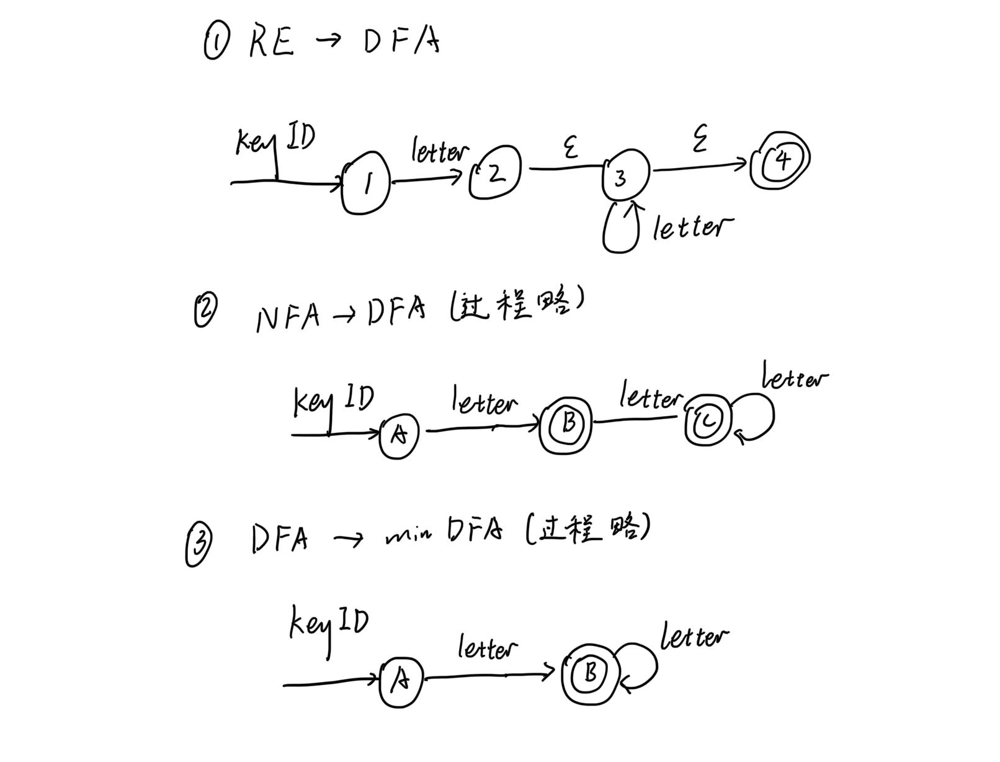
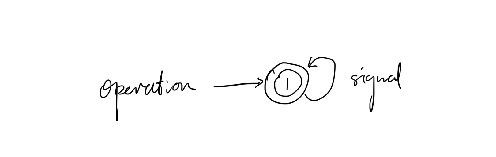
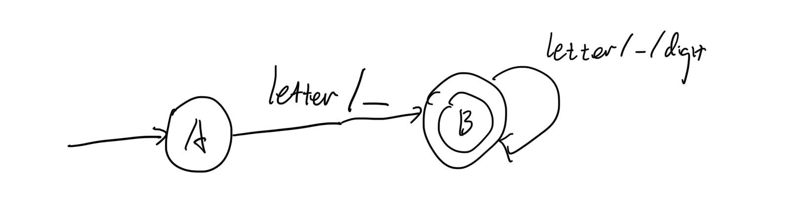
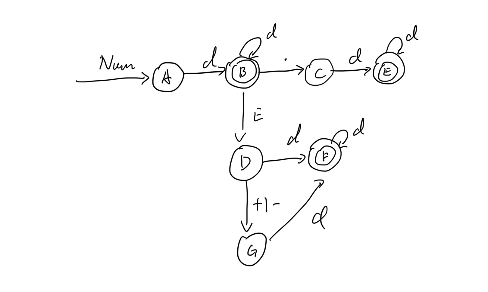
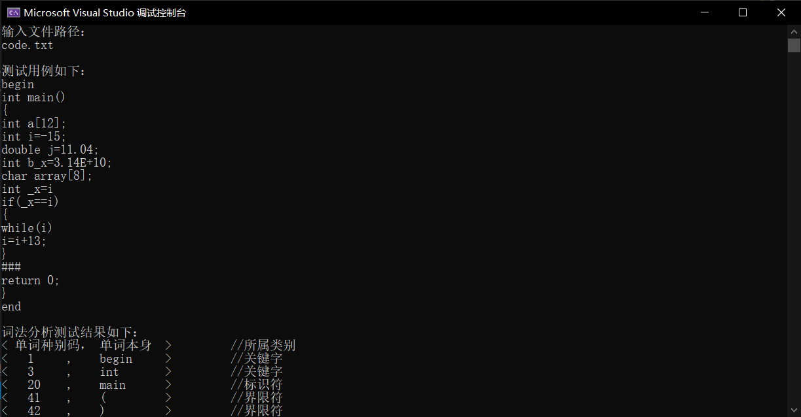
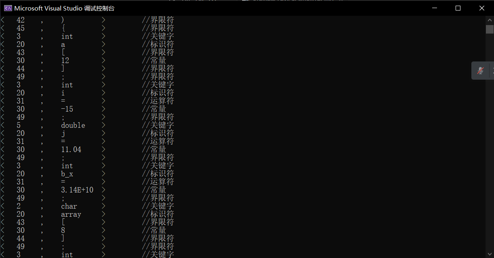
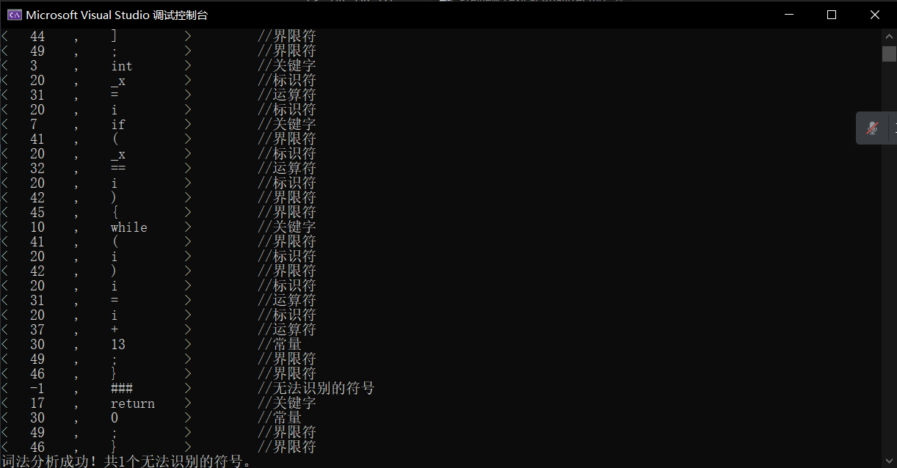

# 词法分析器 实验报告

[TOC]

## 一. 实验内容

1) 写出一个C++或Java或其他语言的一个子集，给出其词法的产生式（词法部分也可以用RE, regular expression）。希望这个mini语言中包含数学运算表达式，赋值，函数调用，控制流语句（分支或循环），类型声明等基本元素。
2) 词法实验部分要求写出该语言的词法分析程序。要求识别出词法分析单元，给出词法单元的分类，按照不同类别填入相应的表中，表中给出词法单元在源程序中的位置。

**具体步骤如下**

1. 词法的产生式（或regular expression）-> NFA
2. NFA -> DFA
3. DFA -> min DFA
4. 根据最小化后的DFA写出词法分析程序。
5. 用这个mini语言写几个小程序，测试你的词法分析程序是否正确。

## 二. 实验原理

词法分析是从左向右一个字符一个字符地读入源程序，扫描每行源程序的符号，依据词法规则，识别单词。执行词法分析的程序称为词法分析器，将给定的程序通过词法分析器，识别出一个个单词符号。单词符号常采用统一的二元式表示：（单词种别码，单词符号自身的值），单词种别码是语法分析所需要的信息，而单词符号自身属性值是编译其他阶段需要的信息。

## 三. 实验设计

1. 关键字：
   "begin","char","int","float","double","const","if","then","else","while","do", "for","break","continue","sizeof",”void”,”return”,"end"
2. 运算符：=、==、>、<、>=、<=、+、-、*、/
3. 界限符：( ) [ ]{ } , : ; 等
4. 标识符（ID）：用字母、数字、下划线的连接用来表示变量名、过程名等的单词称为标识符（不能以数字开头、不与关键字重名、不包含$、#等无法识别的字符）
5. 常量（NUM）：整数、小数、浮点数。
6. 词法分析阶段通常忽略空格、制表符和换行符等。

**状态图分析**

1. 关键字

   本次设计中关键字有18个，分别包括
   "begin","char","int","float","double","const","if","then","else","while","do", "for","break","continue","sizeof",”void”,”return”,"end"

   关键字都是由小写字母组成，在程序中，将18个关键字保存在一个string类型的vector中，然后做一次循环，将字符串逐个与18个关键字对比，相同则取出对应的种别编码，存入事先设计好的vector中。
   关键字的正规表达式为：
    keyID->( letter )+
   letter->[a-z]
   按照 RE -> NFA -> DFA -> min DFA的顺序，过程如图所示
   
   
   
2. 运算符

	本实验设计了十个运算符，分别为：=、==、>、<、>=、<=、+、-、* 、/
	运算符表达式为
	
	operation -> ( = | == | > | < | >= | <= | + | - | * | / )*
	
	按照RE-> NFA -> DFA -> min DFA的顺序，最终得到的min DFA如图所示：
	
	
3. 界限符

	界限符表达式为：
	delimiter -> ( ( | ) | [ | ] | { | } | , | : | ; )*
	从RE -> NFA -> DFA -> min DFA的图示与运算符图示流程相同。此处略
	
4. 标识符

	用字母、数字、下划线的连接用来表示变量名、过程名等的单词称为标识符（不能以数字开头、不与关键字重名、不包含$、#等无法识别的字符）。
	标识符的正规表达式为：
	ID ->( letter | _ ) ( letter | digit | _ )*
    letter->[a-zA-Z]
    digit->[0-9]
	按照RE-> NFA -> DFA -> min DFA的顺序，最终得到的min DFA如图所示：
	
	
5. 常量
	将小数，整数，浮点数三类归并后分为无符号数和有符号数。
	因为有符号数，除了开始有符号外，之后的判断与无符号数是一致的。所以在这里只针对无符号数的正规表达式构造NFA和DFA。
	无符号数正规表达式：
	NUM -> digits op_fra op_exp
	其中：
	digits -> d(d)*
    d -> [0-9]     op_fra-> .digits | ε
    op_exp -> ( E (+|-| ε) digits) | ε
	将上述表达式整合得无符号数NUM的正规表达式为：
	NUM->d(d)* |(d(d)* |ε)((.d(d)* )(E(+|-|ε)d(d)* |ε)|(E(+|-|ε)d(d)*))
	d -> [0-9]
	按照RE-> NFA -> DFA -> min DFA的顺序，最终得到的min DFA如图所示：
	

## 四. 实验结果
这里对文件中的一段程序进行词法分析，输出源程序并将词法分析结果输出。




## 五. 源程序
```c++
#include <iostream>
#include <vector>
#include <string>
#include <fstream>
#include <iomanip>
using namespace std;

/* 单词种别码*/
/*1-20为关键字种别码*/
#define _BEGIN 1     // begin
#define _CHAR 2      // char
#define _INT  3      // int
#define _FLOAT 4     // float
#define _DOUBLE 5    // double
#define _CONST 6     // const
#define _IF 7        // if
#define _THEN 8      // then
#define _ELSE 9      // else
#define _WHILE 10    // while
#define _DO 11       // do
#define _FOR 12      // for
#define _BREAK 13    // break
#define _CONTINUE 14 // continue
#define _SIZEOF 15   // sizeof
#define _VOID 16     // void
#define _RETURN 17   // return
#define _END 18      // end

/*20为标识符种别码*/
#define _ID 20   

/*30为常量种别码*/
#define _NUM 30    

/*31-40为运算符种别码*/
#define _AS 31       // =
#define _EQ 32       // ==
#define _GT 33       // >
#define _LT 34       // <
#define _GE 35       // >=
#define _LE 36       // <=
#define _ADD 37      // + 
#define _SUB 38      // - 
#define _MUL 39      // * 
#define _DIV 40      // / 

/*41-35为运算符种别码*/
#define _LP 41       // (
#define _RP 42       // )
#define _LBT 43      // [
#define _RBT 44      // ]
#define _LBS 45      // {
#define _RBS 46      // }
#define _COM 47      // ,
#define _COL 48      // :
#define _SEM 49      // ;

/*将-1置为无法识别的字符标志码*/
#define _ERROR -1       
int errorNum = 0;    //记载词法分析错误个数 


/*判断是否为字母*/
int IsLetter(char c) {
	if (((c <= 'z') && (c >= 'a')) || ((c <= 'Z') && (c >= 'A')))
		return 1;
	else
		return 0;
}

/*判断是不是关键字*/
int isKeyID(string str)
{
	string keystr[18] = { "begin","char","int","float","double","const","if","then","else","while","do","for","break","continue","sizeof","void","return","end" };
	vector<string> vec(keystr, keystr + 18);
	int i;
	for (i = 0; i < vec.size(); i++)
	{
		if (!str.compare(vec[i]))
		{
			return i + 1;
		}
	}
	return 0;
}


/*判断是否为常量（整数、小数、浮点数）*/
int IsNum(string str) {
	int i = 0, j = 0, k = 0;
	for (; i < str.size(); i++)
	{
		if (!(str[i] >= '0' && str[i] <= '9'))
		{
			k++;
			if (k > j + 1)
			{
				cout << "该常量" << str << "的词法不正确" << endl;
				return false;
			}
			else if (str[i] == '.')
			{
				j++;
				if (j > 1)
				{
					cout << "该常量" << str << "的词法不正确" << endl;
					return false;
				}
			}
			else if ((str[i - 1] >= '0' && str[i - 1] <= '9') && (str[i] == 'E') && ((str[i + 1] >= '0' && str[i + 1] <= '9') || i == str.size() - 1))
			{
				continue;
			}
			else {
				cout << "该常量" << str << "的词法不正确" << endl;
				return false;
			}
		}
	}
	return true;
}


/*词法分析函数*/
vector<pair<int, string> > analyse(vector<string> vec)
{
	vector<pair<int, string> > vectemp;
	int i = 0;
	for (; i < vec.size(); i++)
	{
		if (vec[i].size() == 1)
		{
			if (vec[i] == "=")    //运算符"="
			{
				if (vec[i + 1] == "=")  //若后面跟的是"="，则是运算符"=="
				{
					string s = vec[i];
					s.append(vec[++i], 0, 1);
					pair<int, string> pairIS(_EQ, s);
					vectemp.push_back(pairIS);       //将pair组加到vector数组尾部
				}
				else    //否则是运算符"="
				{
					pair<int, string> pairIS(_AS, vec[i]);
					vectemp.push_back(pairIS);
				}
			}
			else if (vec[i] == ">")   //运算符">"
			{
				if (vec[i + 1] == "=")   //若后面跟的是"="，则是运算符">="
				{
					string s = vec[i];
					s.append(vec[++i], 0, 1);
					pair<int, string> pairIS(_GE, s);
					vectemp.push_back(pairIS);
				}
				else     //否则是运算符">"
				{
					pair<int, string> pairIS(_GT, vec[i]);
					vectemp.push_back(pairIS);
				}
			}
			else if (vec[i] == "<")   //运算符"<"
			{
				if (vec[i + 1] == "=")   //若后面跟的是"="，则是运算符"<="
				{
					string s = vec[i];
					s.append(vec[++i], 0, 1);
					pair<int, string> pairIS(_LE, s);
					vectemp.push_back(pairIS);
				}
				else   //否则是运算符"<"
				{
					pair<int, string> pairIS(_LT, vec[i]);
					vectemp.push_back(pairIS);
				}
			}
			else if (vec[i] == "+")  //运算符"+" 
			{
				if ((vec[i - 1] == "=" || vec[i - 1] == "(") && IsNum(vec[i + 1]))   //判断是否是有符号常量（正数）
				{
					string s = vec[i];
					s.append(vec[++i]);
					pair<int, string> pairIS(_NUM, s);
					vectemp.push_back(pairIS);
				}
				else   //否则是运算符"+"
				{
					pair<int, string> pairIS(_ADD, vec[i]);
					vectemp.push_back(pairIS);
				}
			}
			else if (vec[i] == "-")  //运算符"-"
			{
				if ((vec[i - 1] == "=" || vec[i - 1] == "(") && IsNum(vec[i + 1]))   //判断是否是有符号常量（负数）
				{
					string s = vec[i];
					s.append(vec[++i]);
					pair<int, string> pairIS(_NUM, s);
					vectemp.push_back(pairIS);
				}
				else    //否则是运算符"-"
				{
					pair<int, string> pairIS(_SUB, vec[i]);
					vectemp.push_back(pairIS);
				}
			}
			else if (vec[i] == "*")  //运算符"*" 
			{
				pair<int, string> pairIS(_MUL, vec[i]);
				vectemp.push_back(pairIS);
			}
			else if (vec[i] == "/")   //运算符"/" 
			{
				pair<int, string> pairIS(_DIV, vec[i]);
				vectemp.push_back(pairIS);
			}
			else if (vec[i] == "(")  //运算符"(" 
			{
				pair<int, string> pairIS(_LP, vec[i]);
				vectemp.push_back(pairIS);
			}
			else if (vec[i] == ")")  //运算符")" 
			{
				pair<int, string> pairIS(_RP, vec[i]);
				vectemp.push_back(pairIS);
			}
			else if (vec[i] == "[")  //运算符"[" 
			{
				pair<int, string> pairIS(_LBT, vec[i]);
				vectemp.push_back(pairIS);
			}
			else if (vec[i] == "]") //运算符"]"  
			{
				pair<int, string> pairIS(_RBT, vec[i]);
				vectemp.push_back(pairIS);
			}
			else if (vec[i] == "{")  //运算符"{" 
			{
				pair<int, string> pairIS(_LBS, vec[i]);
				vectemp.push_back(pairIS);
			}
			else if (vec[i] == "}")  //运算符"}" 
			{
				pair<int, string> pairIS(_RBS, vec[i]);
				vectemp.push_back(pairIS);
			}
			else if (vec[i] == ",")  //运算符"," 
			{
				pair<int, string> pairIS(_COM, vec[i]);
				vectemp.push_back(pairIS);
			}
			else if (vec[i] == ":") //运算符":"   
			{
				pair<int, string> pairIS(_COL, vec[i]);
				vectemp.push_back(pairIS);
			}
			else if (vec[i] == ";")  //运算符";" 
			{
				pair<int, string> pairIS(_SEM, vec[i]);
				vectemp.push_back(pairIS);
			}
			else if (vec[i][0] >= '0' && vec[i][0] <= '9')   //判断是否是一位数字常量
			{
				pair<int, string> pairIS(_NUM, vec[i]);
				vectemp.push_back(pairIS);
			}
			else if (IsLetter(vec[i][0]))   //判断是否是一位字母标识符 
			{
				pair<int, string> pairIS(_ID, vec[i]);
				vectemp.push_back(pairIS);
			}
			else
			{
				pair<int, string> pairIS(_ERROR, vec[i]);     //否则是无法识别的字符
				vectemp.push_back(pairIS);
				errorNum++;
			}
		}
		else if ((vec[i][0] <= '9' && vec[i][0] >= '0') || vec[i][0] == '.')  //若单词长度超过1，则判断是否是正确的常量
		{
			if (!IsNum(vec[i]))     //若不是常量，则是无法识别的字符
			{
				pair<int, string> pairIS(_ERROR, vec[i]);
				errorNum++;
			}
			else if ((vec[i + 1][0] == '+' || vec[i + 1][0] == '-') && IsNum(vec[i + 2])) //判断是否是有符号的常量
			{
				string s = vec[i];
				s.append(vec[++i]);
				s.append(vec[++i]);
				pair<int, string> pairIS(_NUM, s);
				vectemp.push_back(pairIS);
			}
			else   //否则是无符号的常量
			{
				pair<int, string> pairIS(_NUM, vec[i]);
				vectemp.push_back(pairIS);
			}
		}
		else if (isKeyID(vec[i]))    //判断是否为关键字
		{
			pair<int, string> pairIS(isKeyID(vec[i]), vec[i]);
			vectemp.push_back(pairIS);
		}
		else if (IsLetter(vec[i][0]) || vec[i][0] == '_')    //判断是否为标识符（以字母或者下划线开头）
		{
			pair<int, string> pairIS(_ID, vec[i]);
			vectemp.push_back(pairIS);
		}
		else    //否则是无法识别的单词
		{
			pair<int, string> pairIS(_ERROR, vec[i]);
			vectemp.push_back(pairIS);
			errorNum++;
		}
	}
	return vectemp;
}

/*该函数用来删除连续的空格和换行符，找到有效字符的位置（第一个参数为目标字符串，第二个参数为开始位置）
  返回值为连续的空格和换行后的第一个有效字符在字符串的位置*/
int getFirstChar(string str, int i)
{
	while (true) {
		if (str[i] != ' ' && str[i] != '\n')
			return i;
		i++;
	}
}

/*获得一个单词符号,从位置i开始查找，用引用参数j来返回这个单词最后一个字符在原字符串的位置*/
string getWord(string str, int i, int& j)
{
	string s(" \n+-*\=()[]{},:;");  //用来隔断单词的字符集合
	j = str.find_first_of(s, i);
	if (j == -1)
		return "";
	if (i != j)
		j--;
	return str.substr(i, j - i + 1);
}

int main()
{
	string str1 = " ";
	string str2 = "\n";
	string filename;
	cout << "输入文件路径："<<endl;
	cin >> filename;
	ifstream infile(filename.c_str());
	if (!infile)
	{
		cerr << "无法打开文件" << filename.c_str() << endl;
		exit(-1);
	}
	cout << endl;
	char s1[1000];
	infile.getline(s1, 1000, EOF);
	infile.close();

	cout << "测试用例如下：\n" << s1 << endl;

	int a = 0, b = 0;   //分别表示单词的第一个和最后一个字符位置
	vector<string> array;
	do {
		a = getFirstChar(s1, a);
		string s2 = getWord(s1, a, b);
		if (b == -1)
			break;
		if (s2.compare(str1) && s2.compare(str2))
			array.push_back(s2);
		a = b + 1;
	} while (true);

	vector<pair<int, string> >  v = analyse(array);
	cout << "\n词法分析测试结果如下：\n< 单词种别码， 单词本身  >         //所属类别" << endl;
	for (int i = 0; i < v.size(); i++)
	{
		cout << "<   " << left << setw(2) << v[i].first << "    ,    " << left << setw(10) << v[i].second << left << setw(10) << ">";
		if (v[i].first > 0 && v[i].first < 20)
		{
			cout << left << setw(20) << "//关键字" << endl;
		}
		else if (v[i].first == 20)
		{
			cout << left << setw(20) << "//标识符" << endl;
		}
		else if (v[i].first == 30)
		{
			cout << left << setw(20) << "//常量" << endl;
		}
		else if (v[i].first > 30 && v[i].first <= 40)
		{
			cout << left << setw(20) << "//运算符" << endl;
		}
		else if (v[i].first > 40 && v[i].first < 60)
		{
			cout << left << setw(20) << "//界限符" << endl;
		}
		else if (v[i].first == -1)
		{
			cout << left << setw(30) << "//无法识别的符号" << endl;
		}
	}
	cout << "词法分析成功！共" << errorNum << "个无法识别的符号。" << endl;
	return 0;
}
```
## 六. 实验体会
本实验难度主要在于其所需的大量的判断，因此需要较长时间理清程序的逻辑。但本人在编写代码之前没有任何准备工作就开始编写，导致思维混乱，不得不进行多次较大的修改，严重影响了实验进度。因此在今后的编程任务中，不应基于编写代码，应先查阅相关资料、梳理好实验的思路再动手编写程序。