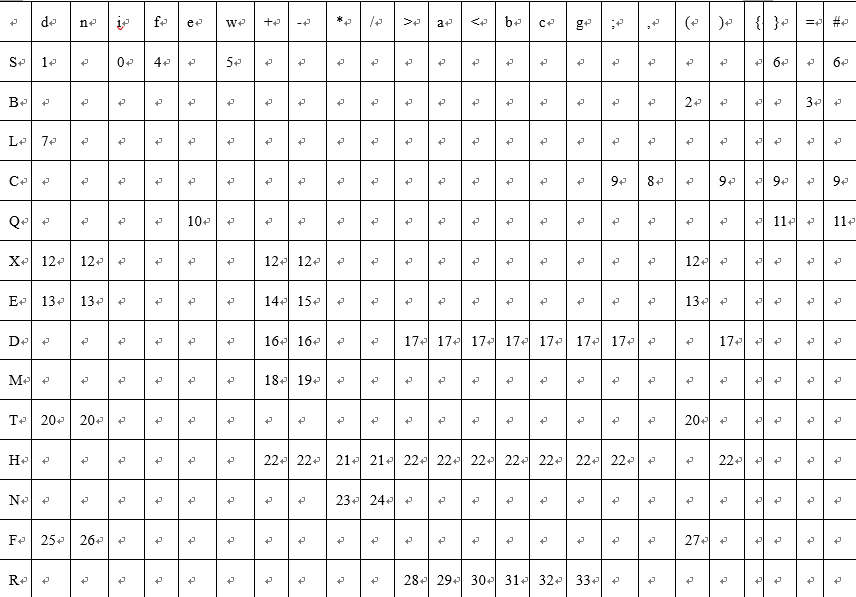
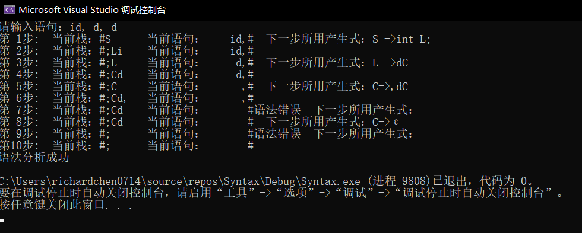
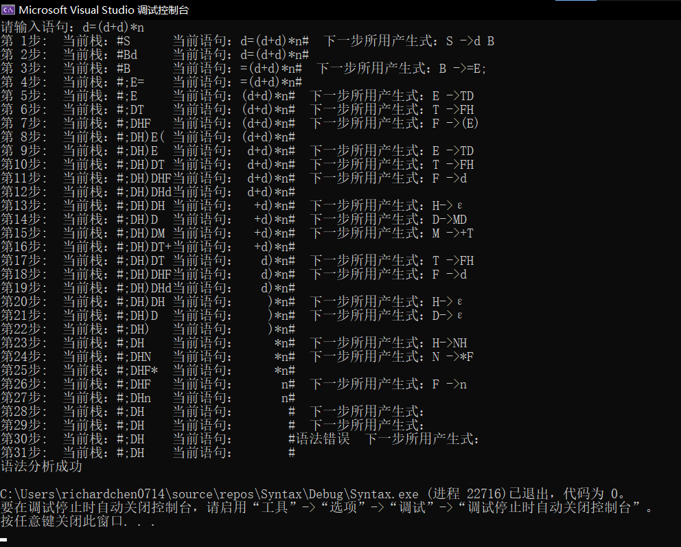
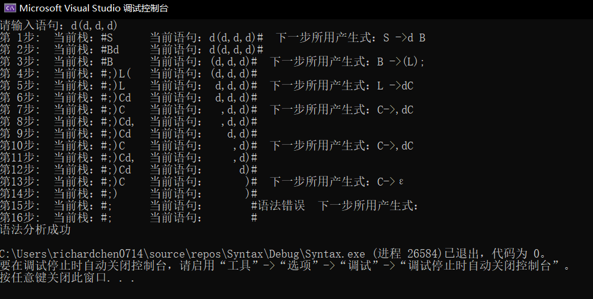
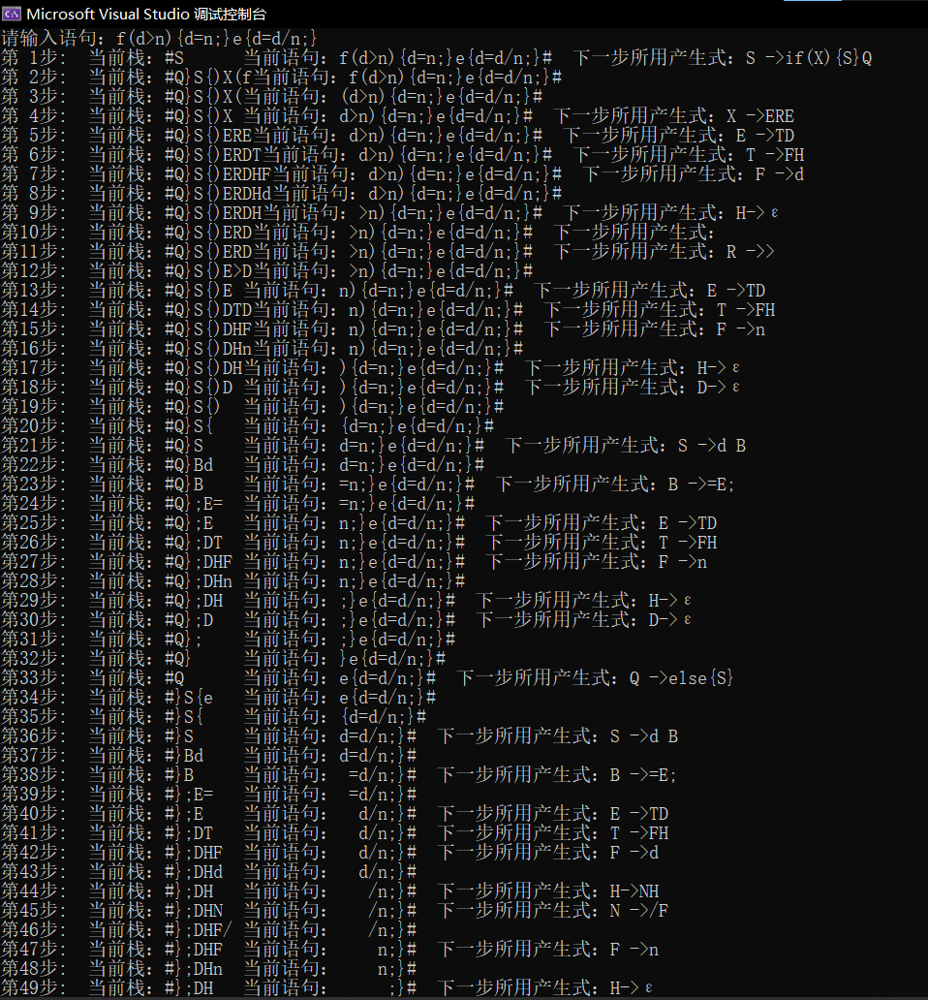
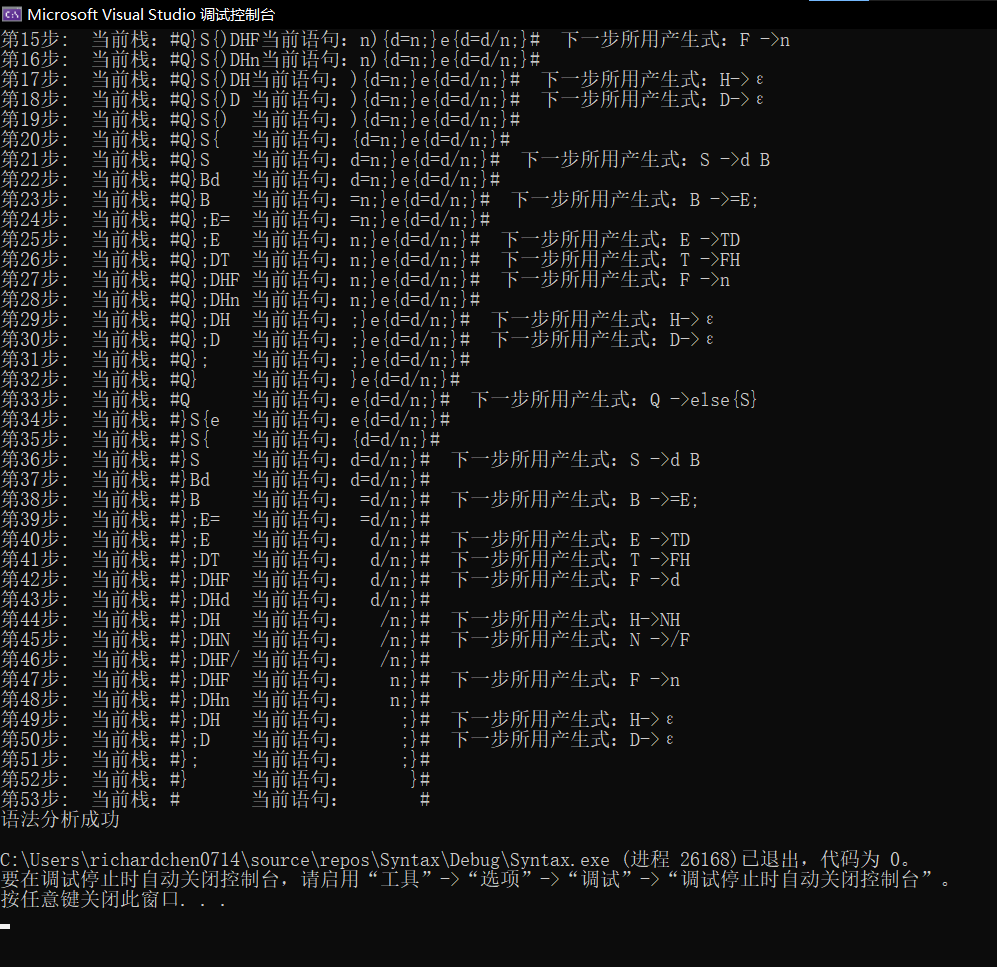
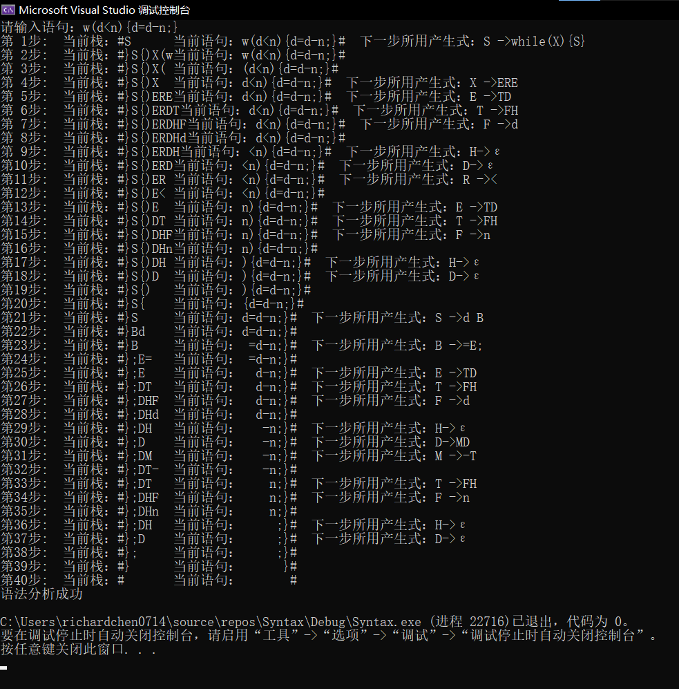

# 语法分析器 实验报告
09019118 陈鸿卓
[TOC]
## 一. 实验内容
写出一个C++或Java或其他语言的一个子集，给出其词法的产生式。希望这个mini语言中包含数学运算表达式，赋值，函数调用，控制流语句（分支或循环），类型声明等基本元素。
本实验设计的是LL(1) 算法分析的语法分析器，并用程序实现了对算术表达式的LL(1) 分析测试。
## 二. 实验原理
语法分析器是在词法分析之后，根据词法分析的结果和定义的语法规则判断输入的程序是否有语法错误，LL(1)分析是使用显式栈而不是递归调用来完成分析。以标准方式表示这个栈非常有用，这样LL(1)分析程序的动作就可以快捷地显现出来。LL(1)的含义是：第一个L表明自顶向下分析是从左向右扫描输入串，第2个L表明分析过程中将使用最左推导，1表明只需向右看一个符号便可决定如何推导，即选择哪个产生式(规则)进行推导。
## 三. 实验设计
1. 定义语法分析使用的文法语言：
> <语句> ::= <变量定义语句> | <赋值语句> | <函数调用语句> | <if语句>
           | <循环语句> | ε
<变量定义语句> ::= int <标识符表>;                       
<赋值语句> ::= <标识符> = <表达式>;
<函数调用语句> ::= <标识符> ( <标识符表> );
<if语句> ::= if ( <条件表达式> ) { <语句> } <else语句>
<else语句> ::= else{ <语句> } | ε
<循环语句> ::= while ( <条件表达式> ) { <语句> }
<标识符表> ::= <标识符>| <标识符表>,<标识符>   	         
<条件表达式> ::= <表达式><比较运算符><表达式>
<比较运算符> ::= > | >= | < | <= | != | ==
<表达式> ::= +T | -T | T | <表达式> + T | <表达式>-T       
T ::= F | T*F | T/F 
F ::= <标识符> | <无符号整数> | (<表达式 >)

2. 将上述文法用产生式表示：
其中，S:语句，Q:else语句，L:标识符表，E:表达式，X:条件表达式，R:比较运算符，id:标识符，n:无符号整数
> S → int L; | id=E; | id(L); | if(X){S}Q | while(X){S} | Ɛ
Q → else{S} | Ɛ
L → id | L,id
X → ERE
R → > | >= | < | <= | == | !=
E → +T | -T | T | E+T | E-T
T → F | T*F | T/F
F → id | n | (E)

3. 提取左公因子：
> S → int L; | id B | if(X){S}Q | while(X){S} | Ɛ
B → (L); | =E;
L → id | L,id
Q → else{S} | Ɛ
X → ERE
R → > | >= | < | <= | == | !=
E → +T | -T | T | EM
M → +T | -T
T → F |TN
N → *F |/F
F → id | n | (E)

4. 消除左递归：          
> S → intL;             
S → idB         
B → (L);          
B → =E;            
S → if(X){S}Q     
S → while(X){S}    
S → Ɛ            
L → idL’        
L’→ ,idL’         
L’→Ɛ            
Q → else{S}        
Q → Ɛ            
X → ERE      
E → TE’         
E → +TE’           
E → -TE’        
E’ → ME’       
E’ → Ɛ       
M → +T       
M → -T         
T → FT’       
T’ → NT’       
T’ → Ɛ          
N → *F        
N → /F           
F → id           
F → n            
F → (E)            
R → >              
R → >=             
R → <          
R → <=           
R → ==             
R → !=         

5. 求FIRST集：
> First(P)={ int , id , if , while , Ɛ }
First(A)={ int , id , if , while , Ɛ }
First(S)={ int , id , if , while , Ɛ }
First(B)={ ( , = }
First(L)={ id }
First(L’)={ ，, Ɛ }
First(Q)={ else , Ɛ }
First(X)={ + , - , id , n , ( }
First(R)={ > , >= , < , <= , != , == }
First(E)={ + , - , id , n , ( }
First(E’)={ + , - , Ɛ }
First(M)={ + , - }
First(T)={ id , n , ( }
First(T’)={ * , / , Ɛ }
First(N)={ * , / }
First(F)={ id , n , ( }

6. 求FOLLOW集：
> Follow (S)={ # , } }
Follow (B)={ # , } }
Follow (L)={ # , ) , ; , } } 
Follow (L’)={ # , ) , ; , } }
Follow (Q)={ # , } }
Follow (X)={ ) }
Follow (R)={ + , - , id , n , ( }
Follow (E)={ ) , ; , > , >= , < , <= , != , == }
Follow (E’)={ ) , ; , > , >= , < , <= , != , == }
Follow (M)={ ) , ; , > , >= , < , <= , != , == , + , - }
Follow (T)={ ) , ; , > , >= , < , <= , != , == , + , - }
Follow (T’)={ ) , ; , > , >= , < , <= , != , == , + , - }
Follow (N)={ ) , ; , > , >= , < , <= , != , == , + , - , * , / }
Follow (F)={ ) , ; , > , >= , < , <= , != , == , + , - , * , / }

7. 构造LL(1)的预测分析表：
在程序实现时暂时不考虑词法的分析，一个字符即为一个单词，所以为了便于程序实现，用C代替L’，D代替E’，H代替T’，用d代替id，i代表int，f代表if，e代替else，w代替while，a代替>=， b代替<= ，c代替== ，g代替!=

LL（1）预测分析表中的数字分别代表的产生式如下：         
> 0：S → intL;            
1：S → idB     
2：B → (L);        
3：B → =E;          
4：S → if(X){P}Q       
5：S → while(X){P}     
6：S → Ɛ         
7：L → idC       
8：C→ ,idC      
9：C→Ɛ           
10：Q → else{P}         
11：Q → Ɛ             
12：X → ERE           
13：E → TD          
14：E → +TD           
15：E → -TD          
16：D→ MD        
17：D→ Ɛ             
18：M → +T            
19：M → -T             
20：T → FH           
21：H→ NH        
22：H→ Ɛ             
23：N → *F            
24：N → /F          
25：F → id             
26：F → n             
27：F → (E)            
28：R → >             
29：R → >=          
30：R → <              
31：R → <=           
32：R → ==            
33：R → !=             

## 四. 实验结果
因为上述语法分析需要针对词法分析的结果进行语法分析,而我在编写C++程序时没有用语法分析器的结果而是采用直接输入程序的，所以在这里导致没有办法识别词法，输入的一个字符即表示一个单词，所以测试的时候d表示标识符id，i表示int，f表示if，e表示else，w代替while，a代替>=， b代替<= ，c代替== ，g代替!=，且输入不能有空格，并且一次只能输入一个语句。

当输入的语句是变量定义语句时：
输入的语句为id, d, d; 意思是int id1,id2,id3;
结果如图：

当输入的语句是赋值语句时：
输入的语句为d=(d+d)*n; 其中d为标识符id，n为无符号整数。
结果如图：

当输入的语句是函数调用语句时：
输入的语句为d(d,d,d); 其中d为不同的标识符id。
结果如图：

当输入的语句是if-else语句时：
输入的语句为f(d>n){d=n;}e{d=d/n;}，意思是if(d>n){d=n;}else{d=d/n;}其中d为标识符id，n为无符号整数。
结果如图：


当输入的语句是循环语句时：
输入的语句为w(d<n){d=d-n;}，意思是while(d<n){d=d-n;} 其中d为标识符id，n为无符号整数。
结果如图：

## 五. 源程序
```c++
#include<stdio.h>
#include<iostream>
#include <iomanip>
#include<string>
#include<malloc.h>
using namespace std;
#define N 100

int ll1_table(int stackTop, int strTop);
char str[30];
char stack[30] = "";

struct Prod {
	char l_char;
	char r_char[15];
	char pro[20];
};

Prod productions[34];
void init();
int stackPush(int* top, Prod prod);
int matching(int* top, char* str);
int main()
{
	int len;
	int stackTop = 1;
	int strTop = 0;
	int i;
	char z[] = "#";
	int index = 0;
	init();//产生式初始化
	stack[0] = '#';
	stack[stackTop] = 'S';
	cout << "请输入语句：";
	cin >> str;


	len = strlen(str);
	str[len] = '#';
	while (stackTop >= 0)
	{
		cout << "第" << right << setw(2) << ++index << "步:  ";
		cout << right << setw(6) << "当前栈：" << left << setw(8) << stack;
		cout << left << setw(8) << "当前语句：" << right << setw(8) << str;

		if (matching(&stackTop, str)) {
			cout << endl;
		}
		else {
			i = ll1_table(stackTop, strTop);
			stackPush(&stackTop, productions[i]);//压栈
			cout << "  下一步所用产生式：" << productions[i].pro << endl;
		}
	}
	if (stackTop + 1 == 0)
	{
		cout << "语法分析成功" << endl;
	}

	return 0;
}

//LL(1)预测分析表的构造
int ll1_table(int stackTop, int strTop)
{
	if (stack[stackTop] == 'S') {
		if (str[strTop] == 'i')
		{
			return 0;
		}
		else if (str[strTop] == 'd') {
			return 1;
		}
		else if (str[strTop] == 'f') {
			return 4;
		}
		else if (str[strTop] == 'w') {
			return 5;
		}
		else if (str[strTop] == '}') {
			return 6;
		}
		else if (str[strTop] == '#') {
			return 6;
		}
		else {
			return -1;
		}
	}
	else if (stack[stackTop] == 'B') {
		if (str[strTop] == '(')
		{
			return 2;
		}
		else if (str[strTop] == '=') {
			return 3;
		}
		else {
			return -1;
		}
	}
	else if (stack[stackTop] == 'L') {
		if (str[strTop] == 'd') {
			return 7;
		}
		else {
			return -1;
		}
	}
	else if (stack[stackTop] == 'C') {
		if (str[strTop] == ';') {
			return 9;
		}
		else if (str[strTop] == ')') {
			return 9;
		}
		else if (str[strTop] == '}') {
			return 9;
		}
		else if (str[strTop] == '#') {
			return 9;
		}
		else if (str[strTop] == ',') {
			return 8;
		}
		else {
			return -1;
		}
	}
	else if (stack[stackTop] == 'Q') {
		if (str[strTop] == '}') {
			return 11;
		}
		else if (str[strTop] == '#') {
			return 11;
		}
		else if (str[strTop] == 'e') {
			return 10;
		}
		else {
			return -1;
		}
	}
	else if (stack[stackTop] == 'X') {
		if (str[strTop] == 'd') {
			return 12;
		}
		else if (str[strTop] == 'n') {
			return 12;
		}
		else if (str[strTop] == '+') {
			return 12;
		}
		else if (str[strTop] == '-') {
			return 12;
		}
		else if (str[strTop] == '(') {
			return 12;
		}
		else {
			return -1;
		}
	}
	else if (stack[stackTop] == 'E') {
		if (str[strTop] == 'd') {
			return 13;
		}
		else if (str[strTop] == 'n') {
			return 13;
		}
		else if (str[strTop] == '(') {
			return 13;
		}
		else if (str[strTop] == '+') {
			return 14;
		}
		else if (str[strTop] == '-') {
			return 15;
		}
		else {
			return -1;
		}
	}
	else if (stack[stackTop] == 'D') {
		if (str[strTop] == '+') {
			return 16;
		}
		else if (str[strTop] == '-') {
			return 16;
		}
		else if (str[strTop] == 'a') {
			return 17;
		}
		else if (str[strTop] == '<') {
			return 17;
		}
		else if (str[strTop] == 'b') {
			return 17;
		}
		else if (str[strTop] == 'c') {
			return 17;
		}
		else if (str[strTop] == 'g') {
			return 17;
		}
		else if (str[strTop] == ';') {
			return 17;
		}
		else if (str[strTop] == ')') {
			return 17;
		}
		else {
			return -1;
		}
	}
	else if (stack[stackTop] == 'M') {
		if (str[strTop] == '+') {
			return 18;
		}
		else if (str[strTop] == '-') {
			return 19;
		}
		else {
			return -1;
		}
	}
	else if (stack[stackTop] == 'T') {
		if (str[strTop] == 'd') {
			return 20;
		}
		else if (str[strTop] == 'n') {
			return 20;
		}
		else if (str[strTop] == '(') {
			return 20;
		}
		else {
			return -1;
		}
	}
	else if (stack[stackTop] == 'H') {
		if (str[strTop] == '*') {
			return 21;
		}
		else if (str[strTop] == '/') {
			return 21;
		}
		else if (str[strTop] == '+') {
			return 22;
		}
		else if (str[strTop] == '-') {
			return 22;
		}
		else if (str[strTop] == '>') {
			return 22;
		}
		else if (str[strTop] == 'a') {
			return 22;
		}
		else if (str[strTop] == '<') {
			return 22;
		}
		else if (str[strTop] == 'b') {
			return 22;
		}
		else if (str[strTop] == 'c') {
			return 22;
		}
		else if (str[strTop] == 'g') {
			return 22;
		}
		else if (str[strTop] == ';') {
			return 22;
		}
		else if (str[strTop] == ')') {
			return 22;
		}
		else {
			return -1;
		}
	}
	else if (stack[stackTop] == 'N') {
		if (str[strTop] == '*') {
			return 23;
		}
		else if (str[strTop] == '/') {
			return 24;
		}
		else {
			return -1;
		}
	}
	else if (stack[stackTop] == 'F') {
		if (str[strTop] == 'd') {
			return 25;
		}
		else if (str[strTop] == 'n') {
			return 26;
		}
		else if (str[strTop] == '(') {
			return 27;
		}
		else {
			return -1;
		}
	}
	else if (stack[stackTop] == 'R') {
		if (str[strTop] == '>') {
			return 28;
		}
		else if (str[strTop] == 'a') {
			return 29;
		}
		else if (str[strTop] == '<') {
			return 30;
		}
		else if (str[strTop] == 'b') {
			return 31;
		}
		else if (str[strTop] == 'c') {
			return 32;
		}
		else if (str[strTop] == 'g') {
			return 33;
		}
		else {
			return -1;
		}
	}
	else {
		cout << "语法错误";
	}
	return -1;
}
void init()
{
	productions[0].l_char = 'S';	strcpy_s(productions[0].r_char, "iL;");		strcpy_s(productions[0].pro, "S ->int L;");
	productions[1].l_char = 'S';	strcpy_s(productions[1].r_char, "dB");			strcpy_s(productions[1].pro, "S ->d B");
	productions[2].l_char = 'B';	strcpy_s(productions[2].r_char, "(L);");		strcpy_s(productions[2].pro, "B ->(L);");
	productions[3].l_char = 'B';	strcpy_s(productions[3].r_char, "=E;"); 		strcpy_s(productions[3].pro, "B ->=E;");
	productions[4].l_char = 'S';	strcpy_s(productions[4].r_char, "f(X){S}Q");	strcpy_s(productions[4].pro, "S ->if(X){S}Q");
	productions[5].l_char = 'S';	strcpy_s(productions[5].r_char, "w(X){S}");	strcpy_s(productions[5].pro, "S ->while(X){S}");
	productions[6].l_char = 'S';	strcpy_s(productions[6].r_char, "ε");			strcpy_s(productions[6].pro, "S ->ε");
	productions[7].l_char = 'L';	strcpy_s(productions[7].r_char, "dC");			strcpy_s(productions[7].pro, "L ->dC");
	productions[8].l_char = 'C';	strcpy_s(productions[8].r_char, ",dC");		strcpy_s(productions[8].pro, "C->,dC");
	productions[9].l_char = 'C';	strcpy_s(productions[9].r_char, "ε");			strcpy_s(productions[9].pro, "C->ε");
	productions[10].l_char = 'Q';	strcpy_s(productions[10].r_char, "e{S}");		strcpy_s(productions[10].pro, "Q ->else{S}");
	productions[11].l_char = 'Q';	strcpy_s(productions[11].r_char, "ε");		strcpy_s(productions[11].pro, "Q ->ε");
	productions[12].l_char = 'X';	strcpy_s(productions[12].r_char, "ERE");		strcpy_s(productions[12].pro, "X ->ERE");
	productions[13].l_char = 'E';	strcpy_s(productions[13].r_char, "TD");		strcpy_s(productions[13].pro, "E ->TD");
	productions[14].l_char = 'E';	strcpy_s(productions[14].r_char, "+TD");		strcpy_s(productions[14].pro, "E ->+TD");
	productions[15].l_char = 'E';	strcpy_s(productions[15].r_char, "-TD");		strcpy_s(productions[15].pro, "E ->-TD");
	productions[16].l_char = 'D';	strcpy_s(productions[16].r_char, "MD");		strcpy_s(productions[16].pro, "D->MD");
	productions[17].l_char = 'D';	strcpy_s(productions[17].r_char, "ε");		strcpy_s(productions[17].pro, "D->ε");
	productions[18].l_char = 'M';	strcpy_s(productions[18].r_char, "+T");		strcpy_s(productions[18].pro, "M ->+T");
	productions[19].l_char = 'M';	strcpy_s(productions[19].r_char, "-T");		strcpy_s(productions[19].pro, "M ->-T");
	productions[20].l_char = 'T';	strcpy_s(productions[20].r_char, "FH");		strcpy_s(productions[20].pro, "T ->FH");
	productions[21].l_char = 'H';	strcpy_s(productions[21].r_char, "NH");		strcpy_s(productions[21].pro, "H->NH");
	productions[22].l_char = 'H';	strcpy_s(productions[22].r_char, "ε");		strcpy_s(productions[22].pro, "H->ε");
	productions[23].l_char = 'N';	strcpy_s(productions[23].r_char, "*F");		strcpy_s(productions[23].pro, "N ->*F");
	productions[24].l_char = 'N';	strcpy_s(productions[24].r_char, "/F");		strcpy_s(productions[24].pro, "N ->/F");
	productions[25].l_char = 'F';	strcpy_s(productions[25].r_char, "d");			strcpy_s(productions[25].pro, "F ->d");
	productions[26].l_char = 'F';	strcpy_s(productions[26].r_char, "n");			strcpy_s(productions[26].pro, "F ->n");
	productions[27].l_char = 'F';	strcpy_s(productions[27].r_char, "(E)");		strcpy_s(productions[27].pro, "F ->(E)");
	productions[28].l_char = 'R';	strcpy_s(productions[28].r_char, ">");			strcpy_s(productions[28].pro, "R ->>");
	productions[29].l_char = 'R';	strcpy_s(productions[29].r_char, "a");			strcpy_s(productions[29].pro, "R ->>=");
	productions[30].l_char = 'R';	strcpy_s(productions[30].r_char, "<");			strcpy_s(productions[30].pro, "R -><");
	productions[31].l_char = 'R';	strcpy_s(productions[31].r_char, "b");			strcpy_s(productions[31].pro, "R -><=");
	productions[32].l_char = 'R';	strcpy_s(productions[32].r_char, "c");			strcpy_s(productions[32].pro, "R ->==");
	productions[33].l_char = 'R';	strcpy_s(productions[33].r_char, "g");			strcpy_s(productions[33].pro, "R ->!=");

}
int stackPush(int* top, Prod prod)
{
	int len;
	int i;
	char c[] = "ε";
	len = strlen(prod.r_char);
	if (!strcmp(prod.r_char, c))
	{
		stack[(*top)] = '\0';
	}
	else {
		for (i = len - 1; i >= 0; i--)
		{
			stack[(*top)++] = prod.r_char[i];
		}

	}
	--(*top);
	return 0;
}
int matching(int* top, char* str)
{
	int len;
	int i;
	if (stack[(*top)] == str[0])
	{
		stack[(*top)--] = '\0';
		len = strlen(str);
		for (i = 0; i < len - 1; i++)
		{
			str[i] = str[i + 1];
		}
		str[i] = '\0';
		return 1;
	}
	else
	{
		return 0;
	}
}
```
## 六. 实验体会
本实验难度主要在于其所需的大量的判断，因此需要较长时间理清程序的逻辑，整个实验耗费时间较长。这次试验让我更好地了解了编译器的语法分析工作原理。