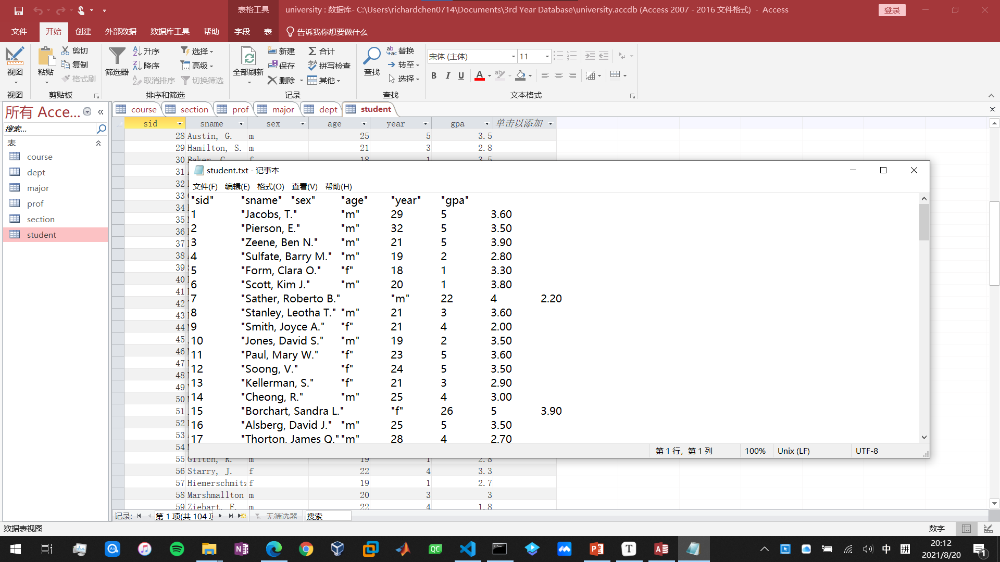
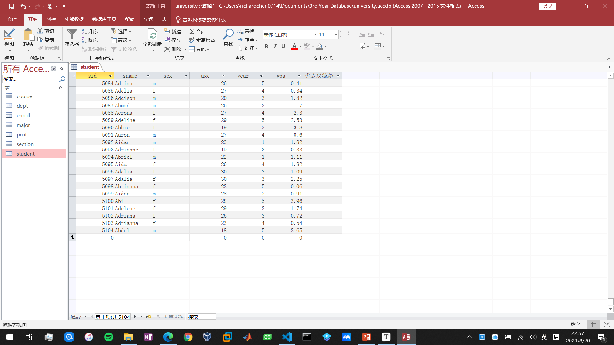

# Lab Project 1

[TOC]
## 实验内容
- 新建一个数据库
- 将.txt文件中的数据导入数据库
- 随机生成大量数据
## 实验目的
熟悉数据库管理软件Access的使用和基本操作。
## 实验步骤
1. 创建数据库
在Access欢迎界面中选择新建数据库，数据库命名为university.accdb（Access 2019默认格式为.accdb），之后进入数据库，新建7张表，并将加粗的keys设置为主键。操作完成后，数据库如下所示：


2. 从.txt文件中导入数据
    首先需要将所有的表关闭（表在打开状态下无法从外部导入数据）。在“外部数据”的“新数据源”。在导入文本向导工具中需要勾选“第一行包含字段名称”，其他只需点击“下一步”。
    **需要注意的是对于student表中的gpa和enroll表中的grade，需要在“设计视图”中将其数据类型转化为双精度浮点型，否则导入的数据会被转化为整数**
    在对7张表的导入数据操作完成后，效果如下所示：（仅用student表来举例）


3. 随机生成5000个学生信息数据
    由于Access自带的SQL工具过于简陋，本次实验采用Python自动生成数据并写入数据库中。
    为了让Python连接Access，首先需要安装Microsoft Access Database Engine，之后在Python命令行中输入如下代码

  ```python
  import pyodbc
  [x for x in pyodbc.drivers() if x.startswith('Microsoft Access Driver')]
  ```
输出['Microsoft Access Driver (*.mdb, *.accdb)']，即已安装好了MS Access Database Engine，可以进行接下来操作。编写如下的Python代码

```python
# FileName: CreateRandom.py
# Author: Richard H. CHEN
import pyodbc  # 连接MS Access需要使用的模块
import random

DBfile = r'C:\Users\richardchen0714\Documents\3rd Year Database\university.accdb'  # 数据库文件路径
conn = pyodbc.connect(
    r'Driver={Microsoft Access Driver (*.mdb, *.accdb)};DBQ=' + DBfile)
# 创建游标
cursor = conn.cursor()
table_name = "student"  # 数据库中的表

# 一些英文名，第一位为性别
engName = ["fAaliyah", "mAaron", "fAarushi", "fAbagail", "fAbbey", "fAbbi", "fAbbie", "fAbby", "mAbdul", "mAbdullah", "mAbe", "mAbel", "fAbi", "fAbia", "fAbigail", "mAbraham", "mAbram", "fAbrianna", "mAbriel", "fAbrielle", "fAby", "fAcacia", "mAce", "fAda", "fAdalia", "fAdalyn", "mAdam", "mAdan", "fAddie", "mAddison",
           "fAddison", "mAde", "fAdelaide", "fAdele", "fAdelene", "fAdelia", "fAdelina", "fAdeline", "mAden", "mAdnan", "mAdonis", "fAdreanna", "mAdrian", "fAdriana", "fAdrianna", "fAdrianne", "mAdriel", "fAdrienne", "fAerona", "fAgatha", "fAggie", "fAgnes", "mAhmad", "mAhmed", "fAida", "mAidan", "mAiden", "fAileen", "fAilsa", "fAimee"]
# 获取数据库中表的全部数据
cursor.execute('SELECT count(1) AS count FROM %s' % table_name)
num = cursor.fetchall()[0][0]  # 表的行数

# 加入5000个数据
for i in range(5000):
    no = num+i+1
    nameIndex = random.randint(0, len(engName)-1)
    sex = engName[nameIndex][0]  # 性别
    name = engName[nameIndex][1:]  # 名
    age = random.randint(18, 30)  # 随机生成年龄
    year = random.randint(1, 5)
    gpa1 = random.uniform(0, 4)
    gpa = round(gpa1, 2)
    sql = "INSERT INTO "+table_name+" (sid, sname, sex, age, year, gpa) VALUES ("+str(
        no)+", '"+name+"', '"+sex+"', "+str(age)+", "+str(year)+", "+str(gpa)+");"
    # print(sql)
    cursor.execute(sql)
    cursor.commit()

cursor.close()
conn.close()  # 关闭游标&连接

```

运行该Python程序，之后刷新Access数据库（点击”全部刷新“），可以看到，该数据库中有5104条数据（加入数据之前有104条数据），即操作成功。


