# Lab Project 2

09019118 陈鸿卓

22 Oct, 2021
[TOC]
## 实验内容
在university_A1数据库中，利用SQL语句进行要求的查询操作。
## 实验目的
熟悉SQL语句以及其在Access中的使用。
## 实验步骤
1. 创建查询
在university_A1.accdb中，依次点击“创建”，“查询设计”，“视图”，创建新的查询并进入SQL查询视图。
2. 编写SQL查询语句
编写对应的SQL查询语句后，点击“运行”，即可查看查询结果。再右键点击对应查询，之后选择“保存”并为其命名，即可保存查询语句及查询结果。
各问题对应的查询语句以及查询结果如下
>Print the names of professors who work in departments that have fewer than 50 PhD students.
```SQL
SELECT prof.pname
FROM prof,dept
WHERE prof.dname=dept.dname AND dept.numphds<50;
```
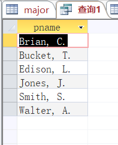
> Print the name(s) of student(s) with the lowest gpa
```SQL
SELECT student.sname
FROM student
WHERE student.gpa=(SELECT MIN(student.gpa)
FROM student);
```
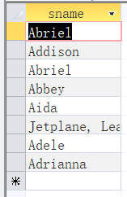
>For each Computer Sciences class, print the cno, sectno, and the average gpa of the students enrolled in the class.
```SQL
SELECT enroll.cno, enroll.sectno, AVG(student.gpa) AS avggpa
FROM enroll, student
WHERE enroll.dname='Computer Sciences' AND enroll.sid=student.sid
GROUP BY enroll.cno,enroll.sectno;
```
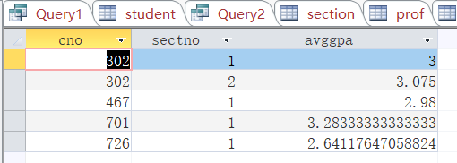
>Print the course names, course numbers and section numbers of all classes with less than six students enrolled in them.
```SQL
SELECT course.cname, course.cno, enroll.sectno
FROM course, enroll
WHERE (course.cno=enroll.cno AND course.dname=enroll.dname)
GROUP BY course.cname, course.cno, enroll.sectno
HAVING COUNT (*)<6;
```
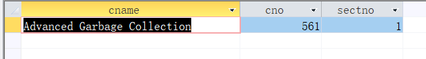
>Print the name(s) and sid (s) of the student(s) enrolled in the most classes
```SQL
SELECT student.sname, enroll.sid   
AS scount
FROM student, enroll
WHERE student.sid=enroll.sid
GROUP BY enroll.sid, student.sname
HAVING COUNT(*)=(
    SELECT MAX(counted)
    FROM(
        SELECT count(*) AS counted
        FROM student, enroll
        WHERE student.sid=enroll.sid
        GROUP BY enroll.sid, student.sname
    )
);
```
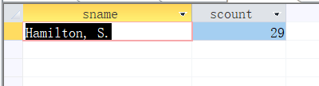
> Print the names of departments that have one or more majors who are under 18 years old.
```SQL
SELECT DISTINCT major.dname
FROM major, student
WHERE major.sid=student.sid AND student.age<18;
```
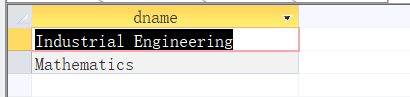
> Print the names and majors of students who are taking one of the College Geometry courses. (Hint: You'll need to use the "like" predicate and the string matching character in your query.)
```SQL
SELECT student.sname, major.dname
FROM student, major, course, enroll
WHERE student.sid=major.sid AND student.sid=enroll.sid AND enroll.dname=course.dname AND enroll.cno=course.cno AND (course.cname='College Geometry 1' OR course.cname= 'College Geometry 2');
```
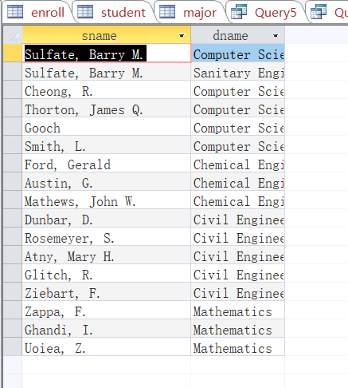
> For those departments that have no majors taking a College Geometry course, print the department name and the number of PhD students in the department.
``` SQL
SELECT dept.dname,dept.numphds
FROM dept
WHERE dept.dname NOT IN(SELECT course.dname
FROM course
WHERE course.cname LIKE 'College Geometry');
```
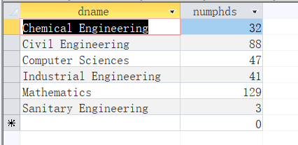
> Print the names of students who are taking both a Computer Sciences course and a Mathematics course.
```SQL
SELECT student.sname FROM student
WHERE student.sid IN
    (SELECT enroll.sid
    FROM enroll
    WHERE enroll.dname='Computer Sciences')
    AND
    student.sid IN
        (SELECT enroll.sid
        FROM enroll
        WHERE enroll.dname='Mathematics');
```
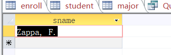
>Print the age difference between the oldest and youngest Computer Sciences major(s).
```SQL
SELECT (MAX(student.age)-MIN(student.age)) AS agedifference
FROM student, major
WHERE student.sid=major.sid AND major.dname='Computer Sciences';
```
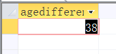
>For each department that has one or more majors with a GPA under 1.0, print the name of the department and the average GPA of its majors.
```SQL
SELECT enroll.dname, Avg(student.gpa) AS avgGpa
FROM student, enroll
WHERE enroll.sid=student.sid
GROUP BY enroll.dname
HAVING Min(student.gpa)<1;
```
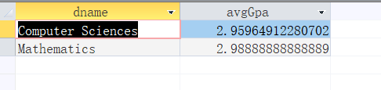
> Print the ids, names, and GPAs of the students who are currently taking all of the Civil Engineering courses.
```SQL
SELECT student.sid, student.sname, student.gpa
FROM student
WHERE NOT EXISTS
    (SELECT course.cno
    FROM course
    WHERE course.dname='Civil Engineering' AND course.cno NOT IN
        (SELECT enroll.cno
        FROM enroll
        WHERE enroll.dname='Civil Engineering' AND enroll.sid=student.sid));
```
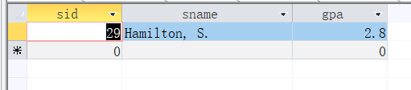
## 实验总结
本次实验让我更好地了解了SQL语言的使用。