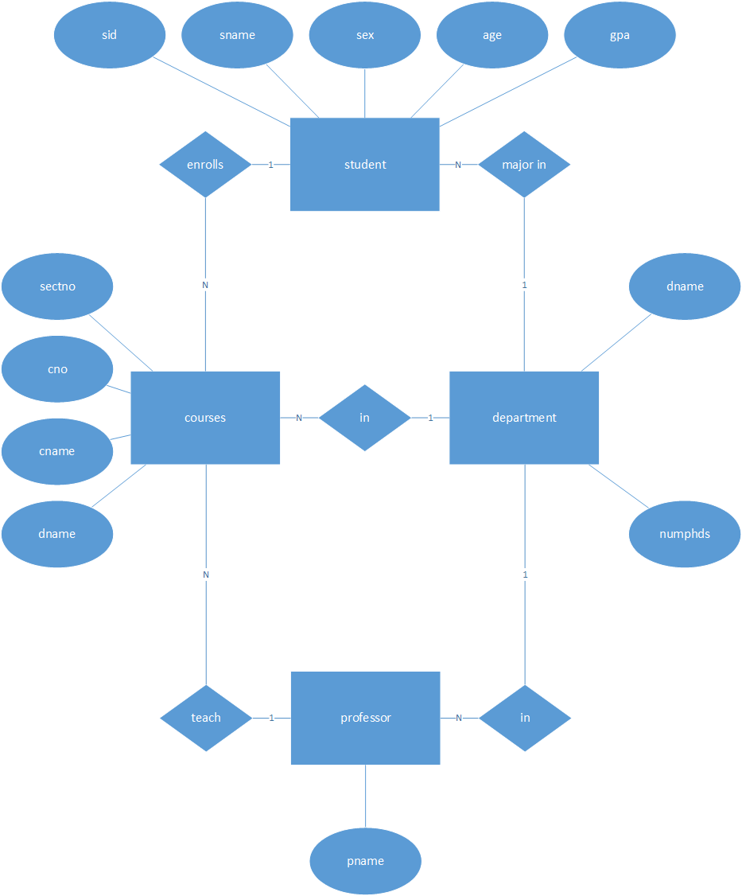

# Lab Project 3

[TOC]

## 实验内容
- 设计数据库university的一些功能，并给出对应的SQL语句。
- 绘制数据库university的E-R图。
## 实验目的
了解数据库的设计，并了解数据库中各成员之间的关系。
## 实验步骤
1. 绘制E-R图
在university数据库中，数据模式如下
student(sid, sname, sex, age, year, gpa)
dept(dname, numphds)
prof(pname, dname)
course(cno, cname, dname)
major(dname, sid)
section(dname, cno, sectno, pname)
enroll(sid, grade, dname, cno, sectno)
绘制出的E-R图如下

2. 设计university数据库一些功能
|功能|SQL语句|
|--|--|
|根据学号查询学生基本信息，包括其专业|SELECT S.sid, S.sname, S.sex, S.age, S.year, S.gpa, M.dname FROM student S, major M WHERE S.sid=M.sid AND S.sid=5;|
|查询学生所选课程及所获成绩|SELECT E.dname, E.cno, E.sectno, E.grade FROM enroll E, student S, course C WHERE S.sid=5 AND S.sid=E.sid AND C.cno=E.cno AND C.dname=E.dname|
|查询某一课程选课名单及成绩|SELECT S.sid, S.sname, E.grade FROM enroll E, student S, course C WHERE C.cno=310 AND C.dname='Chemical Engineering' AND S.sid=E.sid AND C.cno=E.cno AND C.dname=E.dname;|
|查询某一课程所有学生的平均成绩|SELECT AVG(E.grade) as avggrade FROM enroll E WHERE E.dname='Chemical Engineering' AND E.cno=310|
|查询某教授所教的课程|SELECT C.cno, C.cname FROM section S,course C WHERE S.pname='Randolph, B.' AND S.cno=C.cno AND S.dname=C.dname|
|查询某门课程的信息（所属学院授课教师）|SELECT S.dname, C.cno, C.cname, S.pname FROM course C, section S WHERE C.cno=S.cno AND C.dname=S.dname AND C.cno=310 AND C.dname='Chemical Engineering'|
|查询某门课程的最高分、最低分、平均分|SELECT MAX(E.grade) as maxg, MIN(E.grade) as ming, AVG(E.grade) as avgg FROM enroll E WHERE E.cno=310 AND E.dname='Chemical Engineering'|

## 实验总结
这次试验让我更好地了解了数据库成员之间的关系以及数据库常用功能的设计