# Lab Project 4
09019118 陈鸿卓
[TOC]
## 实验内容
对数据库分别设置Domain integrity constraint, entity integrity constraint 和 referential integrity constraint，并使用SQL语句INSERT, DELETE 和 UPDATE 来测试设置的完整性约束。
## 实验目的
了解数据库的完整性约束，并熟悉SQL语句。
## 实验步骤
### Domain integrity constraint
依次点击“视图”->“设计视图”->sid，在“验证规则中输入” **[bid]>0** 如下图所示：
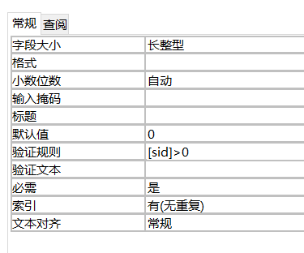
下面使用SQL中的INSERT, DELETE, UPDATE语句来测试完整性设置，保存表。

**INSERT语句**
输入如下的SQL查询语句。
```sql
INSERT INTO student VALUES (-1,'richard','m',12,5,3.0);
```
点击“运行”后结果如下
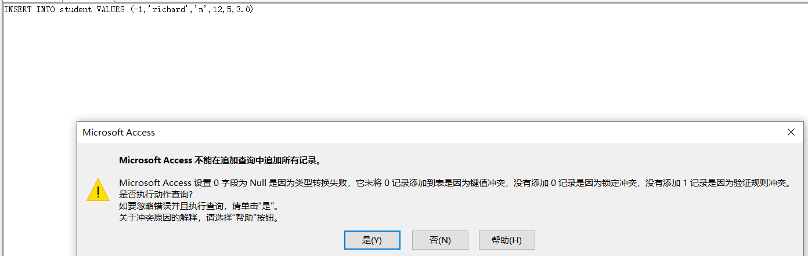

**UPDATE语句**
输入如下的SQL查询语句。
```sql
UPDATE student SET sid=-1 WHERE sid=13;
```
点击“运行”后结果如下
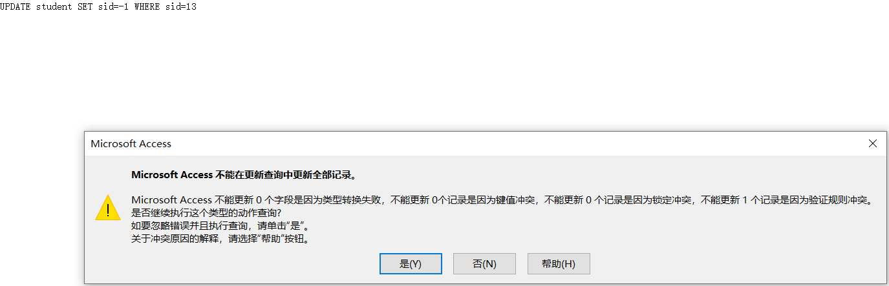

**DELETE语句**
DELETE语句不会破坏domain integrity constraint，此处用来测试delete语句的作用
```SQL
DELETE from student where sid=21;
```
点击“运行”后结果如下，可以看到21号学生已被移除。
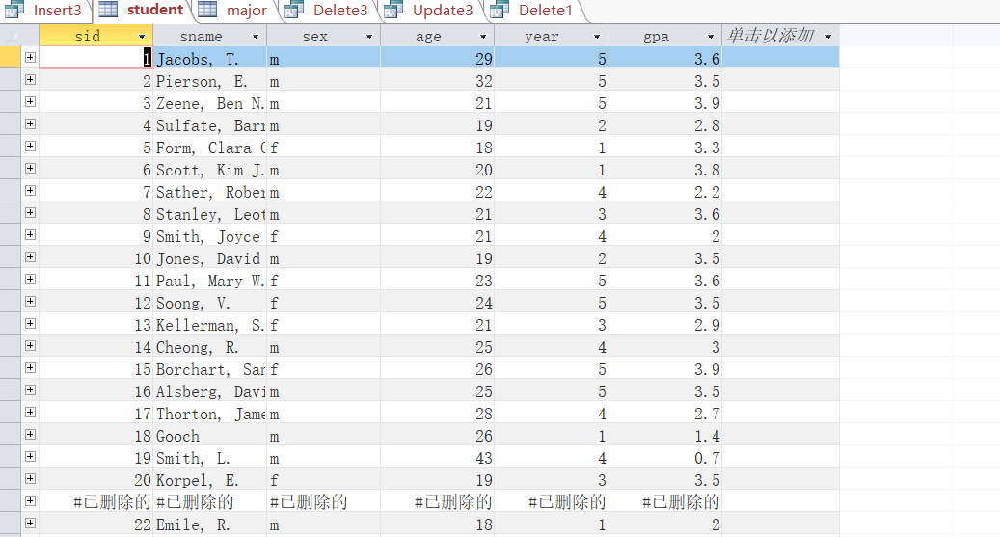
### Entity integrity constraint

**INSERT语句**
输入如下的SQL查询语句
```sql
INSERT INTO student VALUES(Null,'richard','m',12,5,3.0);
```
点击“运行”后结果如下
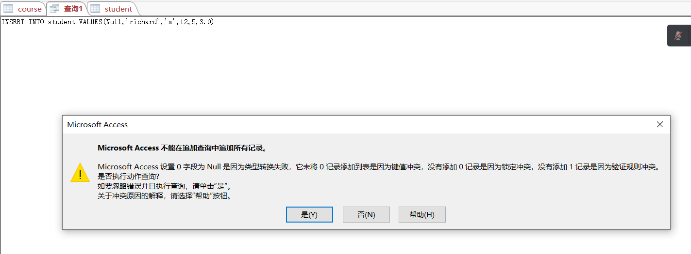

**UPDATE语句**
输入如下的SQL查询语句
```SQL
UPDATE student SET sid=Null WHERE sid=15;
```
点击“运行”后结果如下
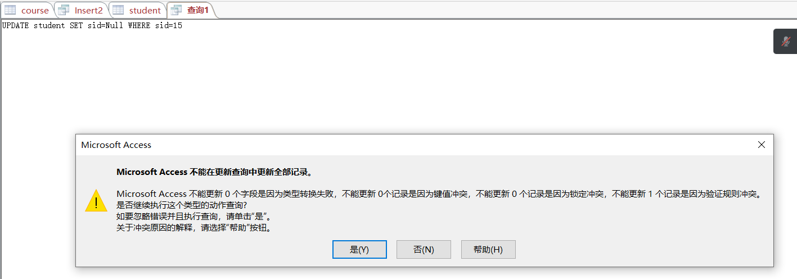

**DELETE语句**
DELETE语句不会破坏domain integrity constraint，此处用来测试delete语句的作用
```SQL
DELETE from course WHERE cno=726;
```
点击“运行”后结果如下，可以看到cno为726的课程已被移除。
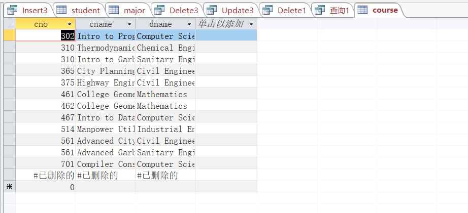
### Referential integrity constraint
创建referential integrity constraint 的方法如下：
- 在“数据库工具”中点击“关系”，选择所有表，点击“添加”。
- 将students下的sid拖到major下的sid处，在弹出的窗口中依次勾选三个勾选项，再点击“创建”。接下来再将dept下的dname拖到major下的dname中，再进行同样操作。
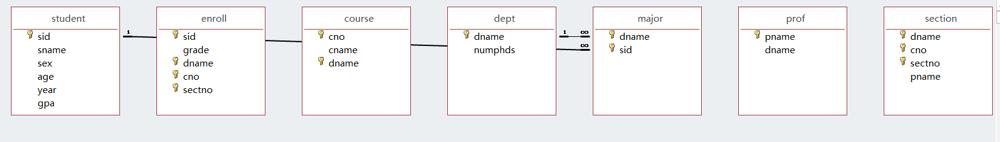
建立起了如上图所示的关系

之后再选项卡中右键单击创建的关系，点击“关闭”

**INSERT语句**
输入如下的SQL查询语句
```SQL
INSERT INTO major VALUES (105,'Mathematics');
```
点击“运行”后结果如下，由于student表中不含105号学生，插入失败
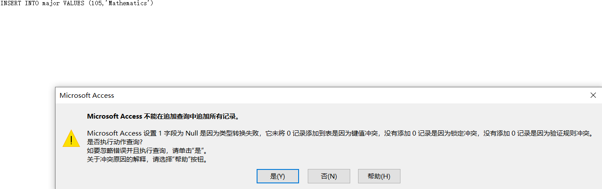

**UPDATE语句**
输入如下的SQL查询语句
```SQL
UPDATE student SET sid=105 WHERE sid=103;
```
点击“运行”后结果如下
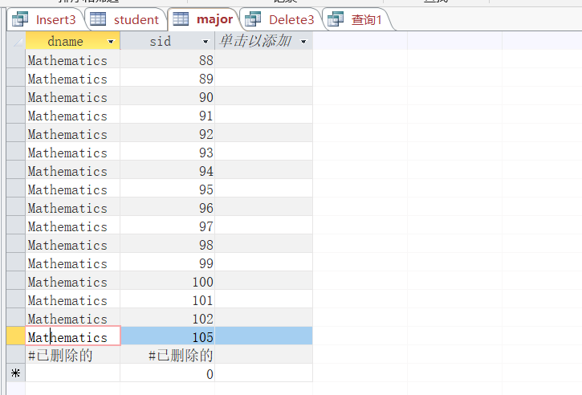
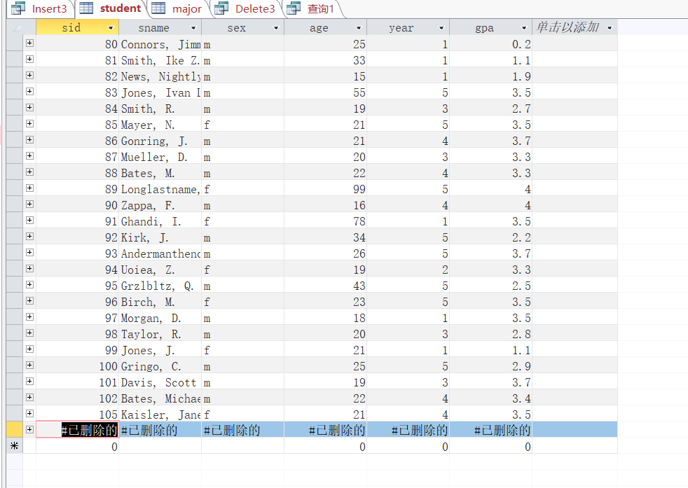
可以看到原来的103号学生sid再student和major中均变为105

**DELETE语句**
输入如下的SQL查询语句
```SQL
DELETE from student where sid=104;
```
点击“运行”后结果如下
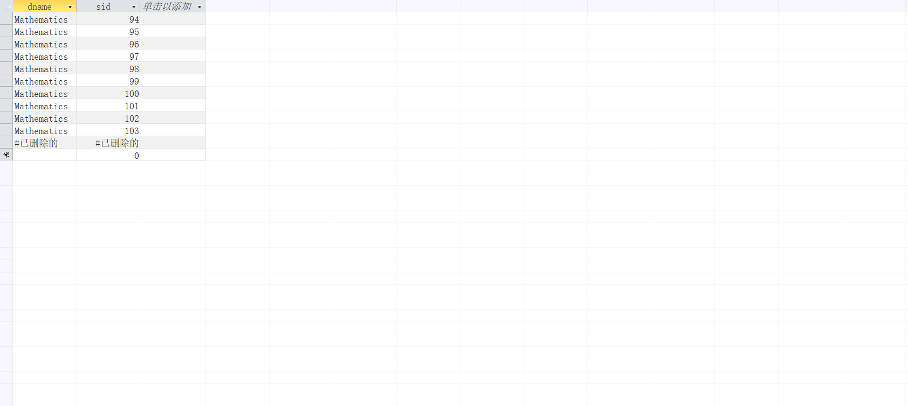
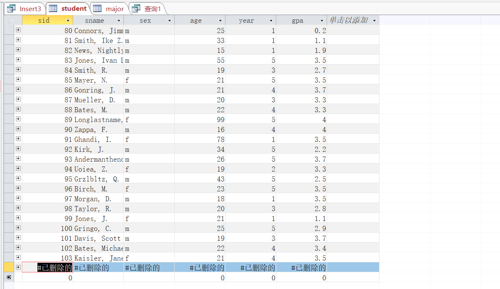
可以发现student和major中104号学生均被删除
## 实验总结
本次实验让我了解了SQL语言中INSERT, DELETE, UPDATE的使用，也让我了解了数据完整性