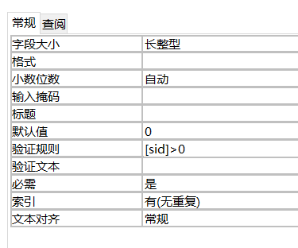
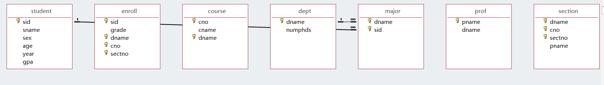
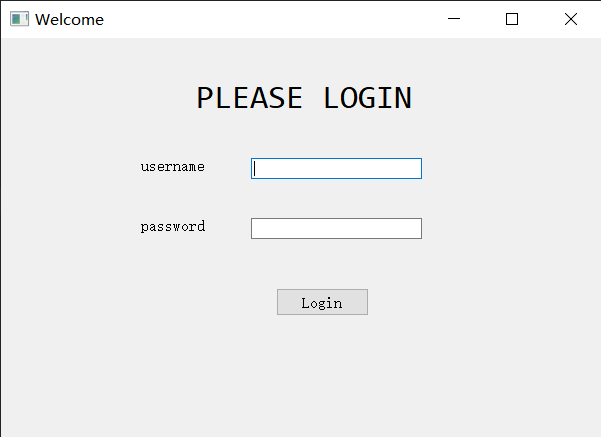
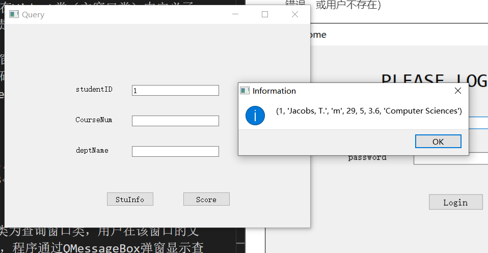

# Lab 5
09019118 陈鸿卓
[TOC]
## Main Contents
实现Lab3中设计的功能，并增加一些功能（本实验增加的功能为：实现用户登录）
## Database Design

本实验中，数据模式如下
>student(sid, sname, sex, age, year, gpa)
dept(dname, numphds)
prof(pname, dname)
course(cno, cname, dname)
major(dname, sid)
section(dname, cno, sectno, pname)
enroll(sid, grade, dname, cno, sectno)
user(uname,passwd) //新增的表，用于存放登陆的用户和密码

同时，增加了 Lab 4 中的完整性约束，如图1、2所示
<center>
    
    <center>图1</center>
</center>

<center>
    
    <center>图2</center>
</center>

## Function Design

在本次实验中实现的功能，以及使用的 SQL 语句如下
- 根据学号查询学生基本信息，包括其专业
```sql
SELECT S.sid, S.sname, S.sex, S.age, S.year, S.gpa, M.dname
FROM student S, major M
WHERE S.sid=M.sid AND S.sid=5;
```
- 查询学生所选课程及所获成绩
```sql
SELECT E.dname, E.cno, E.sectno, E.grade
FROM enroll E, student S, course C
WHERE S.sid=5 AND S.sid=E.sid AND C.cno=E.cno AND C.dname=E.dname
```
- 增加登陆功能（比较基础，目前只实现了用户登陆，且用户不存在及密码错误时弹窗提示的功能）登陆时用户名为richard，密码为0714

## Software Design & Implementation
编程语言：Python，使用PyQt制作图形界面。最终使用pyinstaller将代码打包成.exe，其中.exe必须与university.accdb在同一文件夹下才可以正常运行。
下面为本项目中一些重要的抽象类：
1. 为访问数据库，在本实验中设计了一个数据库接口—— DAO (Data Access Object) 类，用于程序与数据库之间的交互。在Widget类（主窗口类）中定义了一个DAO对象，负责程序运行中的数据库查询。

2. Widget类为主窗口类，为用户登录界面，如图3所示。若用户名与密码匹配，则显示QueryWidget窗口，否则通过QMessageBox出异常信息（密码错误，或用户不存在）

<center>
    
    <center>图3</center>
</center>

3. QueryWidget类为查询窗口类，用户在该窗口的文本框中输入信息后，程序通过QMessageBox弹窗显示查询的信息。若信息输入有误（比如学号不存在）或不完整，则弹窗提示错误信息。
窗口中，点击StuInfo按钮后，弹窗显示学号为studentID的学生信息，点击Score按钮后，弹窗显示学号为studentID的课程号为CourseNum，开课院系为deptName的课程成绩。

<center>
    
    <center>图4 查询学号为1的学生的信息</center>
</center>

4. main.py为程序入口，在本程序中定义了一个Widget类，即登陆界面。

## 实验总结
通过本实验，我了解了高级语言与数据库连接、并使用SQL查询数据库的方法。