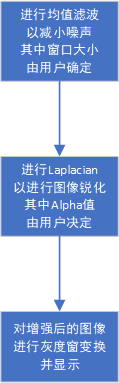
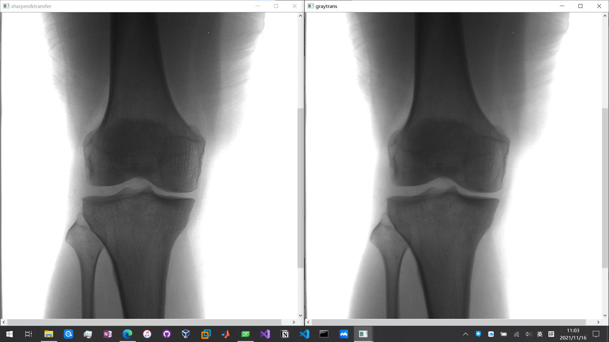
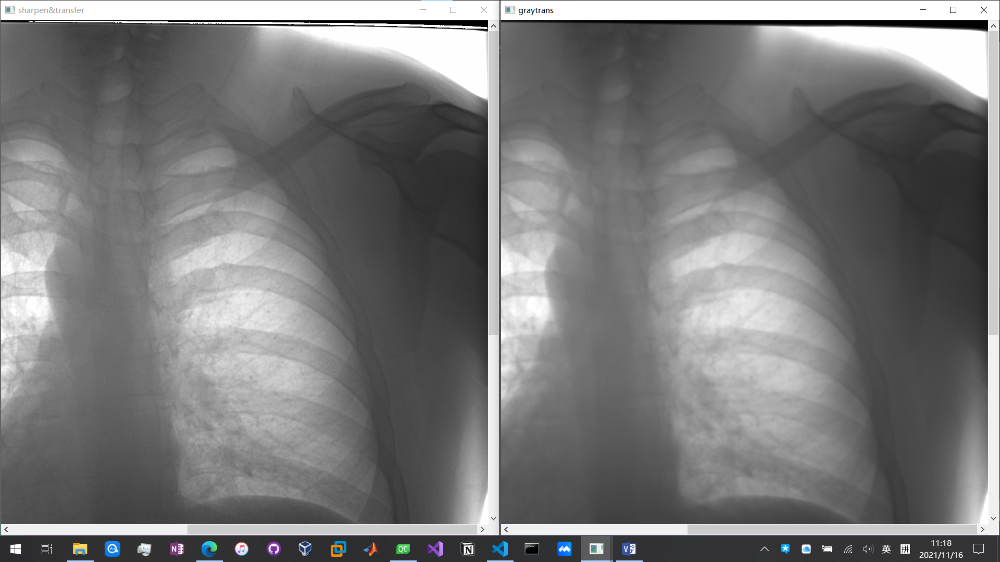
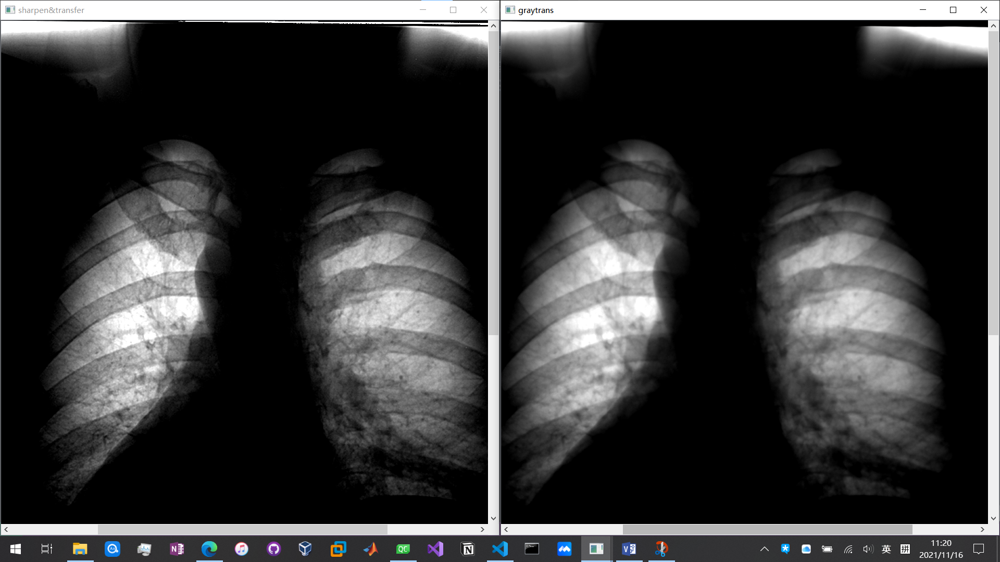

# 数字图像处理 实验3 实验报告
09019118 陈鸿卓
[TOC]
## 实验目标
本实验要求扩展实验2（灰度映射实验），设计图像增强处理流程，实现图像细节增强，同时要求增强后的图像噪声没有明显放大。增强后的图像可以调用实验2的功能显示。
## 处理流程
本实验的图像处理流程如下
- 利用**均值滤波器**进行图像平滑，滤波器窗口大小为kernelSize1
- 利用**Laplacian**提取图像高频部分，并将原图像与乘以系数Alpha后的Laplacian提取的图像高频部分叠加，以达到图像锐化的效果
- 由于不同图像的不同特征，滤波器参数需要由用户在窗口中输入。

图像处理的流程图如下

## 实验结果

下图中，左图为经过图像增强后的图像，右图未经增强。可以看到左图纹理比较清晰（骨骼左下部分比较明显），其中kernelSize1=3, Alpha=1.5

下图中，左图为经过图像增强后的图像，右图未经增强。可以看到左图骨骼比较清晰，其中kernelSize1=3, Alpha=4

下图中，左图为经过图像增强后的图像，右图未经增强。可以看到左图纹理骨骼比较清晰，其中kernelSize1=3, Alpha=4
