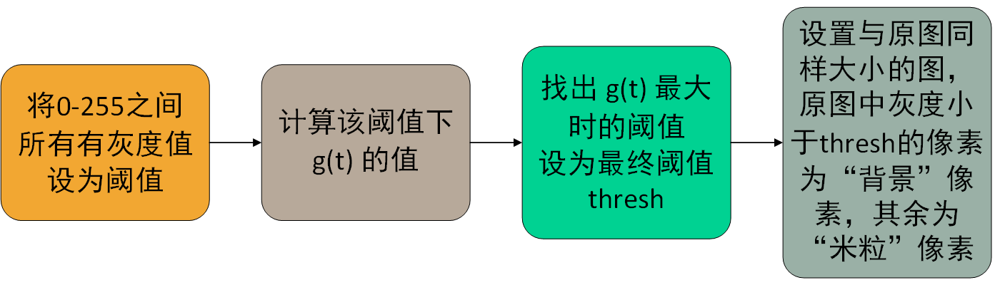
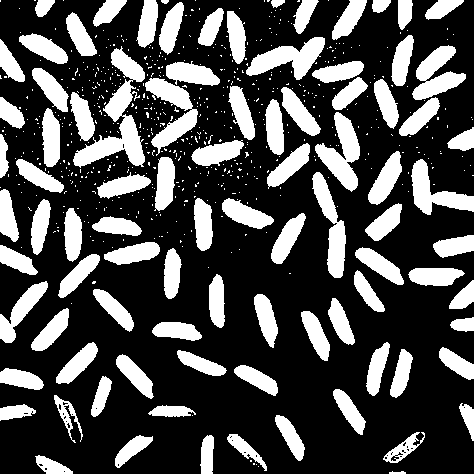
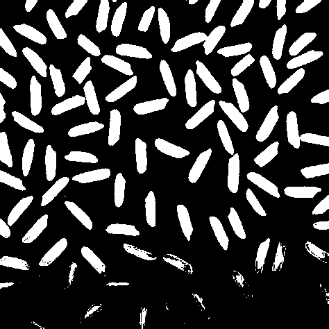

# 数字图像处理 实验3 实验报告
[TOC]
## 实验目标
本实验要求设计图像分割算法完成实验图像的分割。
## 处理流程
本实验使用了阈值法，分别使用了最大熵阈值和大津阈值，并对两者的效果进行了对比。
- 最大值阈值

最大熵阈值算法是在图像中找出一个最佳灰度阈值，使得背景与前景两个部分熵之和最大。其流程如图1所示

    
    
图1

- 大津阈值

大津阈值算法是在图像中找出一个最佳灰度阈值，使得背景与前景两个部分的 $g(t)$ 之和最大。其中$$g(t)=w_0(u_0-u)^2+w_1*(u_1-u)^2$$公式中，前景与背景的分割阈值为 $t$ ，前景点占图像比例为 $w_0$ ，灰度均值为 $u_0$ ，背景点占图像比例为 $w_1$，灰度均值为 $u_1$ ，整个图像灰度均值为 $u$ 。
其流程如图2所示

    
    
图2

## 实验结果
图3为使用最大熵阈值进行分割的结果

    
    
图3

图4为使用大津阈值进行分割的结果

    
    
图4

可以发现，采用大津阈值分割后的图像中一些米粒没有被成功分割，因此对于本实验的图片，使用最大熵阈值更为合适。