# 操作系统课程设计 实验1——Linux进程管理及其扩展
[TOC]
## 实验内容
阅读并分析Linux内核源代码，了解进程控制块、进程队列等数据结构。实现一个系统调用hide，使得可以根据指定的参数隐藏进程，使用户无法使用ps或top观察到进程状态。
1. 实现系统调用int hide(pid_t pid, int on)，在进程pid有效的前提下，如果on置1，进程被隐藏，用户无法通过ps或top观察到进程状态；如果on置0且此前为隐藏状态，则恢复正常状态。
2. 考虑权限问题，只有root用户才能隐藏进程。
3. 设计一个新的系统调用int hide_user_processes(uid_t uid, char *binname)，参数uid为用户ID号，当binname参数为NULL时，隐藏该用户的所有进程；否则，隐藏二进制映像名为binname的用户进程。该系统调用应与hide系统调用共存。
4. 在/proc目录下创建一个文件/proc/hidden，该文件可读可写，对应一个全局变量hidden_flag，当hidden_flag为0时，所有进程都无法隐藏，即便此前进程被hide系统调用要求隐藏。只有当hidden_flag为1时，此前通过hide调用要求被屏蔽的进程才隐藏起来。
5. 在/proc目录下创建一个文件/proc/hidden_process，该文件的内容包含所有被隐藏进程的pid，各pid之间用空格分开。
## 实验目的
通过实验，加深理解进程控制块、进程队列等概念，了解进程管理的具体实施方法。
## 设计思路与流程图
1. 修改进程控制块（相当于PCB）的数据结构，增加int cloak参数，默认为0，1表示该进程隐藏。在使用ps或者top指令的时候，事实上也就是系统调用，所以要在显示进程的系统调用的地方按照cloak的值进行过滤。
2. 考虑权限时，需要修改cloak的hide系统调用中增加对权限的判断，使用全局变量current->uid获取当前用户权限，值为0代表root用户。
3. int hide_user_processes(uid_t uid, char *binname)系统调用按照uid或者uid和进程名对进程进行隐藏的系统调用。在kernel/sys.c添加系统调用。
4. 在/proc目录下创建一个文件/proc/hidden，该文件可读可写，对应一个全局变量hidden_flag，当hidden_flag为0时，所有进程都无法隐藏，即便此前进程被hide系统调用要求隐藏。只有当hidden_flag为1时，此前通过hide调用要求被屏蔽的进程才隐藏起来。这个hidden_flag相当于更高级别的控制，当其为0时，仍然可以对cloak操作，但是隐藏的作用失效。

流程图如下

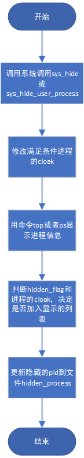
## 源程序
本实验首先要**修改内核代码**，使用装有gcc和g++的Fedora 7操作系统，通过wget命令获取Linux内核，内核版本为2.6.21，然后用sudo tar命令解压。
1. 修改include/linux/sched.h中的存储进程控制块
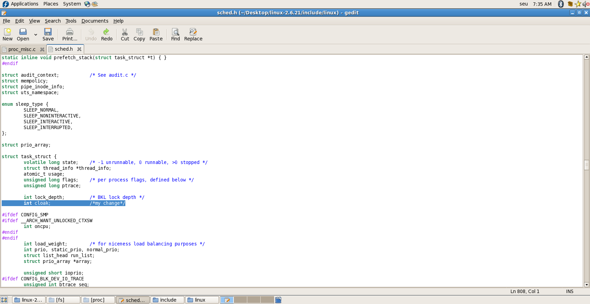
2. 在进程创建时对cloak初始化为0（不隐藏）
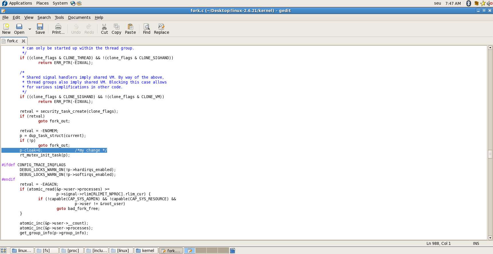
3. 创建hide系统调用，在fs/proc/base.c中添加：首先用find_task_by_pid()函数查找进程，然后根据on参数设置cloak，最后调用函数proc_flush_task()来清除VFS层缓冲。
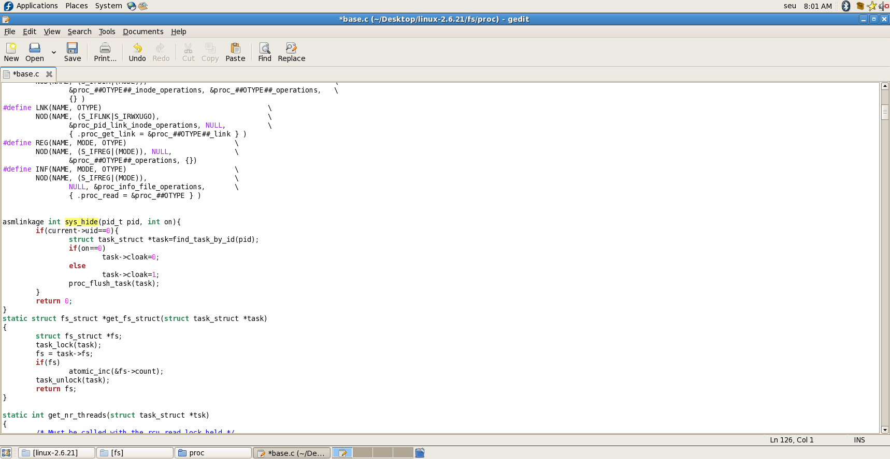
4. 修改同一文件下的proc_pid_readdir()函数以及proc_pid_lookup()函数过滤掉被隐藏的进程。
proc_pid_readdir()如下
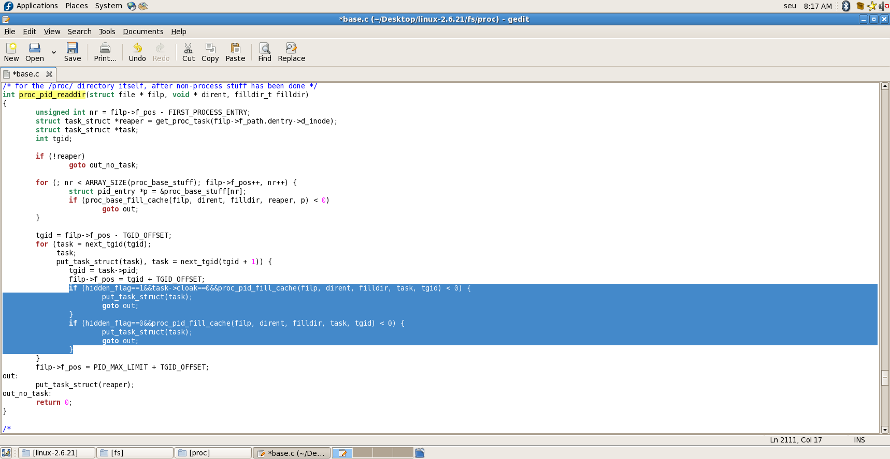
proc_pid_lookup()如下
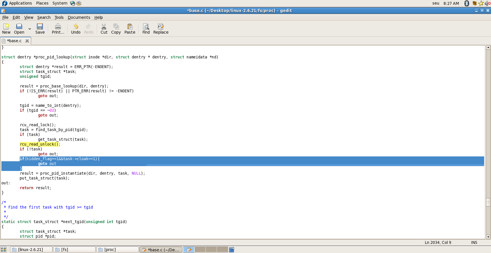

之后使用make等命令编译修改过的内核（通过Linux官方文档、CSDN等查找编译过程。由于该过程过于复杂，且跟着各种博客一步一步做完之后思维非常混乱，忘记了编译过程，此处无法给出）。
再次启动时，会提示选择内核，选择seu，即上述步骤编译后得到的内核。
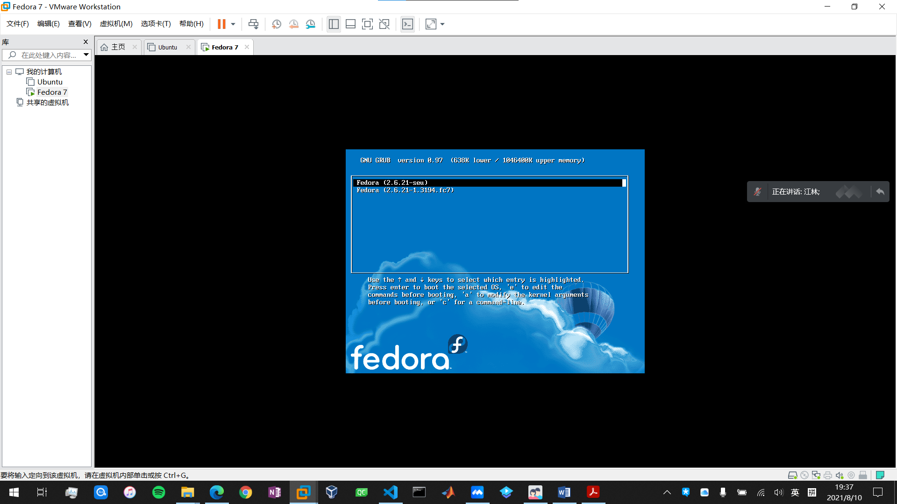
## 程序运行时的初值和运行结果
1. **隐藏特定用户的进程**
首先使用id命令查看用户id
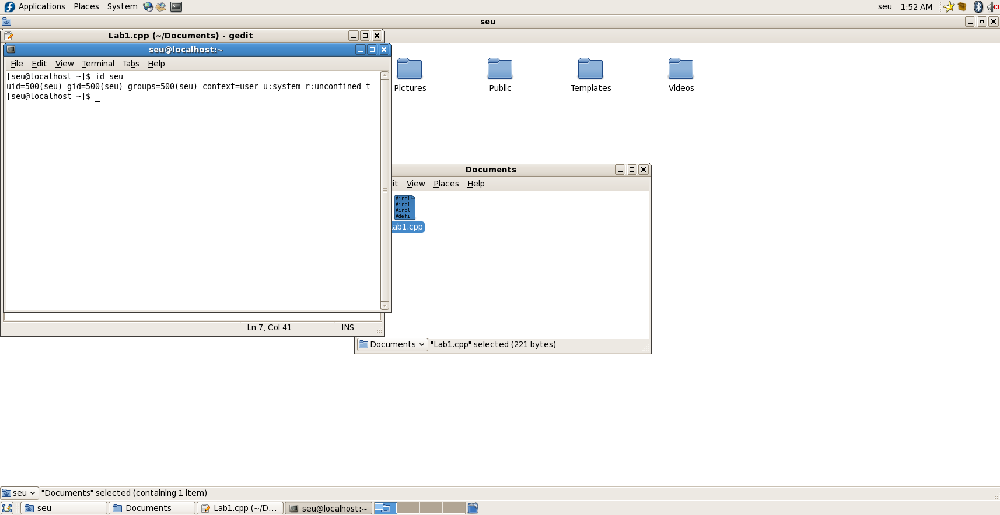
用户id为500
运行该程序之前，可以看到有用户为seu的进程运行
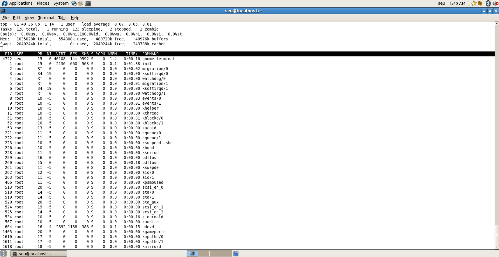
执行以下程序
```c++
#include<linux/unistd.h>
#include<sys/syscall.h>
#include<stdio.h>
#include<unistd.h>
#define __NR_hide_user_process 321
int main(){
	printf("%d",321);
	syscall(__NR_hide_user_process, 500, 0); // uid 500 is this user
	printf("%d",321);
}
```
运行该程序之后，再执行top命令，可以看到用户为seu的进程已经不显示
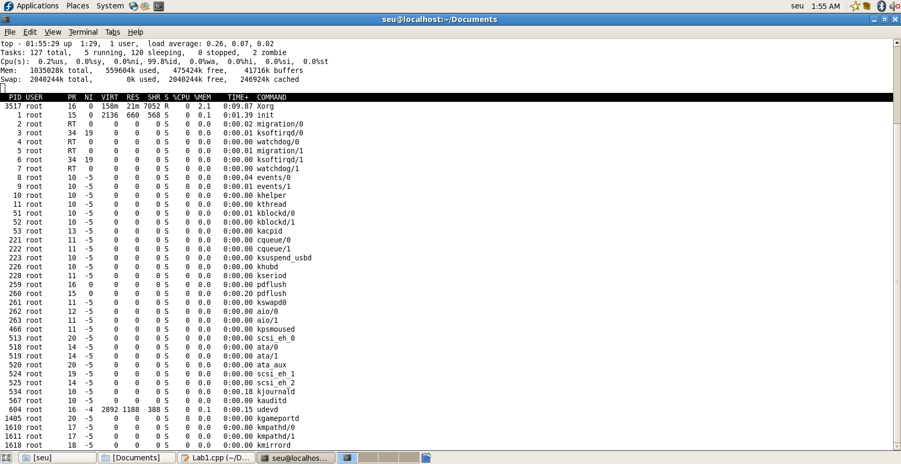
2. **隐藏特定pid的进程**
首先将hidden_flag设置为1
运行程序前，执行top命令结果如下
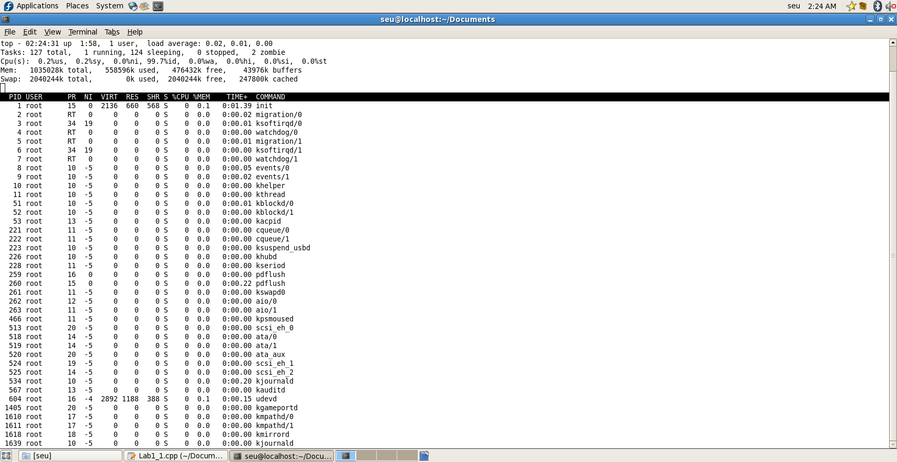
执行以下程序
```c++
#include<linux/unistd.h>
#include<sys/syscall.h>
#include<stdio.h>
#include<unistd.h>
#define __NR_hide 320
int main(){
	printf("%d",320);
	syscall(__NR_hide, 1618, 1); // 1618 is the pid I want to hide
	printf("%d",320);
}
```
执行后结果如下
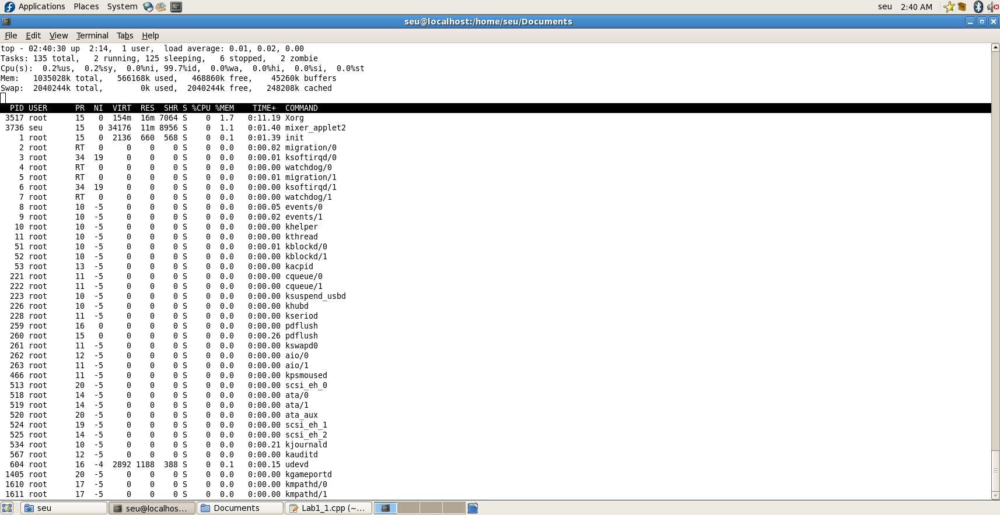
可以看到1618被隐藏
3. 查看隐藏的pid
由于hidden_process为系统文件，因此通过命令行的方式进行读取，隐藏root用户（uid等于0）的所有进程，下图可见所有被隐藏的pid。
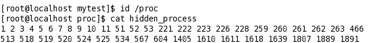
## 实验体会
由于对Linux内核缺少认识，自己在本次实验中不得不频繁查阅相关博客、文档等资源，而不同文章中实验的内核版本、操作系统的差异又让不同文章给出的方法有巨大差别，因此自己在编译内核工作中走了很多弯路。
在听完授课老师短小精悍的实验介绍之后，由于个人能力不足，对本次实验的难度产生了错误认识。而这次试验的真实难度与个人认知的巨大差异，不仅让我认识到了Linux内核操作的高难度、高技术含量，还让我对东南大学计算机科学与技术的专业课程的极高的质量，以及授课教师高超的浓缩、概括知识的能力有了更多了解。在今后的学习生活中，为提高学习效率，应适当调整自己在每一门课程中的参与度。多在网络上看一些为自己这样的“能力不足者”而作的计算机科学入门内容，才能更好的听懂计算机学科全国排名第二的东南大学的高质量课程。