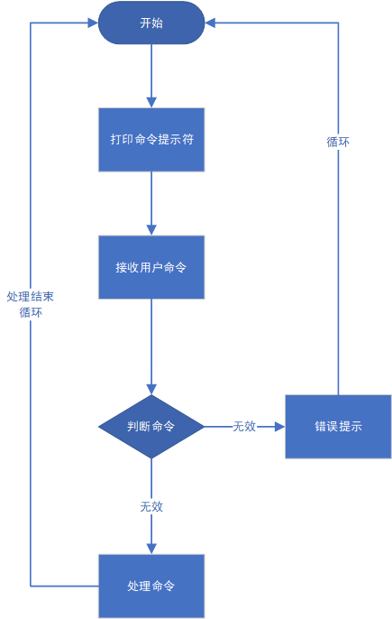

# 操作系统课程设计 实验2——Shell的实现
09019118 陈鸿卓
August 12, 2021
[TOC]
## 实验内容
实现具有管道、重定向功能的shell，能够执行一些简单的基本命令，如进程执行、列目录等。
1. 设计一个C语言程序，完成最基本的shell角色：给出
命令行提示符、能够逐次接受命令；
对于命令分成三种
    - 内部命令（例如help命令、exit命令等）
    - 外部命令（常见的ls、cp等，以及其他磁盘上的可执行程序HelloWrold等）
    - 无效命令（不是上述二种命令）
2. 具有支持管道的功能，即在shell中输入诸如“dir | more”能够执行dir命令并将其输出通过管道将其输入传送给more。
3. 具有支持重定向的功能，即在shell中输入诸如“dir> direct.txt”能够执行dir命令并将结果输出到direct.txt
4. 将上述步骤直接合并完成
## 实验目的
通过实验，了解Shell实现机制。
## 设计思路与流程图
Shell 能够解析的语法为：
```shell
commandline := pipecommand | pipecommand "&" commandline | empty
pipecommand := redirectcommand | pipecommand "|" redirectcommand
redirectcommand := command ">" outfile |
command "<" infile |
command "<" infile ">" outfile |
command ">" outfile "<" infile |
command
command := program | command argument
```
针对词法分析可以采用模块化的strtok()函数进行词法分析。
不同命令的实现如下
1. 重定向命令的实现
	- 首先利用fgets()函数读到用户输入的shell 命令，采用一个数组来保存shell命令，数组有固定的大小。
    - 在main()函数中判断命令种类，主要可以分为exit, cd命令以及其他命令。
2. 判断命令是否存在
本程序使用 command -v xxx 来判断命令xxx是否存在。若命令存在，则会返回该命令的路径信息；否则，不会返回信息。因此可以用这一点来判断命令是否存在。
3. cd 命令的实现
cd 命令的实现主要依赖于系统调用chdir()。我们通过将第一个参数传入chdir 就可以进行一次成功的cd 调用。通过判断chdir()不同的返回值可以判断出更改目录成功与否，并能输出错误原因。
3. exit 命令的实现
exit 命令分两部分实现。当词法分析到exit 的时候直接调用系统调用exit()。
4. 执行外部命令
该程序是给主函数调用的，参数是命令的长度，主要作用是创建子进程，在子进程中调用callCommandWithPipe()函数，该函数可以处理包含管道的命令，父进程获取子进程的返回码，并返回给主函数。
5. 处理多重管道
因为要递归处理多重管道，因此将参数设为左闭右开的指令区间。先判断有没有管道符号，若没有，则直接调用callCommandWithRedi()函数去执行命令，该函数可以处理包含重定向信息的命令。若有管道符号，则先判断管道符号后续是否有指令，若没有，则返回错误信息，若有，则执行。
执行时，先启动管道，在子进程中执行管道符号前半部分的命令，并返回执行后的状态结果。父进程等待子进程退出后，获取子进程的返回码。若子进程没有正常执行，则读取子进程输出的错误信息，并打印到控制台。否则，递归执行管道符号后半部分的命令，并将结果返回给主函数。
9. 处理重定向
函数首先判断指令是否存在。若指令不存在，则直接返回错误信息，不需要再继续执行。
当指令存在时，先判断是否有合法的重定向，再进行下一步处理。同样，在子进程中执行程序。C语言对于重定向的处理，可以使用文件读写的方式，也可以使用其它。为了使得代码比较简洁，我使用freopen()这一神器来实现输入、输出重定向。随后使用execvp()函数执行命令。若执行失败，则会把错误编号存在errno中，返回errno；若执行成功，则会返回0。
父进程等待子进程结束，并读取子进程的返回码。若不为0，则使用strerror()函数获取对应的错误信息，并打印到控制台。

流程图如下


## 源程序
```c++
//Lab2.c
#include <stdio.h>
#include <string.h>
#include <stdlib.h>
#include <unistd.h>
#include <sys/wait.h>
#include <sys/signal.h>
#include <sys/types.h>
#include <errno.h>
#include <pwd.h>

#define BUF_SZ 256

const char* COMMAND_EXIT = "exit";
const char* COMMAND_HELP = "help";
const char* COMMAND_CD = "cd";
const char* COMMAND_IN = "<";
const char* COMMAND_OUT = ">";
const char* COMMAND_PIPE = "|";

// 内置的状态码
enum {
	RESULT_NORMAL,
	ERROR_FORK,
	ERROR_COMMAND,
	ERROR_WRONG_PARAMETER,
	ERROR_MISS_PARAMETER,
	ERROR_TOO_MANY_PARAMETER,
	ERROR_CD,
	ERROR_SYSTEM,
	ERROR_EXIT,
	//重定向的错误信息
	ERROR_MANY_IN,
	ERROR_MANY_OUT,
	ERROR_FILE_NOT_EXIST,
	
	// 管道的错误信息
	ERROR_PIPE,
	ERROR_PIPE_MISS_PARAMETER
};

char username[BUF_SZ];
char hostname[BUF_SZ];
char curPath[BUF_SZ];
char commands[BUF_SZ][BUF_SZ];

int isCommandExist(const char* command);
void getUsername();
void getHostname();
int getCurWorkDir();
int splitCommands(char command[BUF_SZ]);
int callExit();
int callCommand(int commandNum);
int callCommandWithPipe(int left, int right);
int callCommandWithRedi(int left, int right);
int callCd(int commandNum);

int main() {
	//获取当前工作目录、用户名、主机名
	int result = getCurWorkDir();
	if (ERROR_SYSTEM == result) {
		fprintf(stderr, "\e[31;1mError: System error while getting current work directory.\n\e[0m");
		exit(ERROR_SYSTEM);
	}
	getUsername();
	getHostname();
	char argv[BUF_SZ];
	//启动shell
	while (true) {
		printf("\e[32;1m%s@%s:%s\e[0m$ ", username, hostname,curPath); //显示为绿色
		//获取用户输入的命令 
		fgets(argv, BUF_SZ, stdin);
		int len = strlen(argv);
		if (len != BUF_SZ) {
			argv[len-1] = '\0';
		}

		int commandNum = splitCommands(argv);
		
		if (commandNum != 0) {// 用户输入了命令
			if (strcmp(commands[0], COMMAND_EXIT) == 0) { // 是exit命令
				result = callExit();
				if (ERROR_EXIT == result) {
					exit(-1);
				}
			} else if (strcmp(commands[0], COMMAND_CD) == 0) { // cd命令
				result = callCd(commandNum);
				switch (result) {
					//处理错误，输出颜色为红色
					case ERROR_MISS_PARAMETER:
						fprintf(stderr, "\e[31;1mError: Miss parameter while using command \"%s\".\n\e[0m"
							, COMMAND_CD);
						break;
					case ERROR_WRONG_PARAMETER:
						fprintf(stderr, "\e[31;1mError: No such path \"%s\".\n\e[0m", commands[1]);
						break;
					case ERROR_TOO_MANY_PARAMETER:
						fprintf(stderr, "\e[31;1mError: Too many parameters while using command \"%s\".\n\e[0m"
							, COMMAND_CD);
						break;
					case RESULT_NORMAL: // cd命令正常执行，更新当前工作l目录
						result = getCurWorkDir();
						if (ERROR_SYSTEM == result) {
							fprintf(stderr
								, "\e[31;1mError: System error while getting current work directory.\n\e[0m");
							exit(ERROR_SYSTEM);
						} else {
							break;
						}
				}
			} else { // 其它命令
				result = callCommand(commandNum);
				switch (result) {
					case ERROR_FORK:
						fprintf(stderr, "\e[31;1mError: Fork error.\n\e[0m");
						exit(ERROR_FORK);
					case ERROR_COMMAND:
						fprintf(stderr, "\e[31;1mError: Command not exist in myshell.\n\e[0m");
						break;
					case ERROR_MANY_IN:
						fprintf(stderr, "\e[31;1mError: Too many redirection symbol \"%s\".\n\e[0m", COMMAND_IN);
						break;
					case ERROR_MANY_OUT:
						fprintf(stderr, "\e[31;1mError: Too many redirection symbol \"%s\".\n\e[0m", COMMAND_OUT);
						break;
					case ERROR_FILE_NOT_EXIST:
						fprintf(stderr, "\e[31;1mError: Input redirection file not exist.\n\e[0m");
						break;
					case ERROR_MISS_PARAMETER:
						fprintf(stderr, "\e[31;1mError: Miss redirect file parameters.\n\e[0m");
						break;
					case ERROR_PIPE:
						fprintf(stderr, "\e[31;1mError: Open pipe error.\n\e[0m");
						break;
					case ERROR_PIPE_MISS_PARAMETER:
						fprintf(stderr, "\e[31;1mError: Miss pipe parameters.\n\e[0m");
						break;
				}
			}
		}
	}
}
//判断指令是否存在，存在返回1，否则返回0
int isCommandExist(const char* command) {
	if (command == NULL || strlen(command) == 0) return 0;

	int result = 1;
	
	int fds[2];
	if (pipe(fds) == -1) {
		result = 0;
	} else {
		//暂存输入输出重定向标志
		int inFd = dup(STDIN_FILENO);
		int outFd = dup(STDOUT_FILENO);

		pid_t pid = vfork();
		if (pid == -1) {
			result = 0;
		} else if (pid == 0) {
			//将结果输出重定向到文件标识符
			close(fds[0]);
			dup2(fds[1], STDOUT_FILENO);
			close(fds[1]);

			char tmp[BUF_SZ];
			sprintf(tmp, "command -v %s", command);
			system(tmp);
			exit(1);
		} else {
			waitpid(pid, NULL, 0);
			//输入重定向 
			close(fds[1]);
			dup2(fds[0], STDIN_FILENO);
			close(fds[0]);

			if (getchar() == EOF) { //没有数据，意味着命令不存在
				result = 0;
			}
			
			//恢复输入、输出重定向
			dup2(inFd, STDIN_FILENO);
			dup2(outFd, STDOUT_FILENO);
		}
	}
	return result;
}
//获取当前登录的用户名
void getUsername() {
	struct passwd* pwd = getpwuid(getuid());
	strcpy(username, pwd->pw_name);
}
//获取主机名
void getHostname() {
	gethostname(hostname, BUF_SZ);
}
//获取当前的工作目录
int getCurWorkDir() {
	char* result = getcwd(curPath, BUF_SZ);
	if (result == NULL)
		return ERROR_SYSTEM;
	else return RESULT_NORMAL;
}
//以空格分割命令，返回分割得到的字符串个数
int splitCommands(char command[BUF_SZ]) { 
	int num = 0;
	int i, j;
	int len = strlen(command);
	for (i=0, j=0; i<len; ++i) {
		if (command[i] != ' ') {
			commands[num][j++] = command[i];
		} else {
			if (j != 0) {
				commands[num][j] = '\0';
				++num;
				j = 0;
			}
		}
	}
	if (j != 0) {
		commands[num][j] = '\0';
		++num;
	}
	return num;
}
//发送terminal信号退出进程
int callExit() {
	pid_t pid = getpid();
	if (kill(pid, SIGTERM) == -1) 
		return ERROR_EXIT;
	else return RESULT_NORMAL;
}
//给用户使用的函数，用以执行用户输入的命令
int callCommand(int commandNum) { 
	pid_t pid = fork();
	if (pid == -1) {
		return ERROR_FORK;
	} else if (pid == 0) {
		//获取标准输入、输出的文件标识符
		int inFds = dup(STDIN_FILENO);
		int outFds = dup(STDOUT_FILENO);
		int result = callCommandWithPipe(0, commandNum);
		//还原标准输入、输出重定向 
		dup2(inFds, STDIN_FILENO);
		dup2(outFds, STDOUT_FILENO);
		exit(result);
	} else {
		int status;
		waitpid(pid, &status, 0);
		return WEXITSTATUS(status);
	}
}
//所要执行的指令区间[left, right)，可能含有管道
int callCommandWithPipe(int left, int right) {
	if (left >= right) return RESULT_NORMAL;
	// 判断是否有管道命令
	int pipeIdx = -1;
	for (int i=left; i<right; ++i) {
		if (strcmp(commands[i], COMMAND_PIPE) == 0) {
			pipeIdx = i;
			break;
		}
	}
	if (pipeIdx == -1) { //不含有管道命令
		return callCommandWithRedi(left, right);
	} else if (pipeIdx+1 == right) { // 管道命令'|'后续没有指令，参数缺失
		return ERROR_PIPE_MISS_PARAMETER;
	}
	//执行命令
	int fds[2];
	if (pipe(fds) == -1) {
		return ERROR_PIPE;
	}
	int result = RESULT_NORMAL;
	pid_t pid = vfork();
	if (pid == -1) {
		result = ERROR_FORK;
	} else if (pid == 0) { //子进程执行单个命令
		close(fds[0]);
		dup2(fds[1], STDOUT_FILENO); //将标准输出重定向到fds[1]
		close(fds[1]);
		
		result = callCommandWithRedi(left, pipeIdx);
		exit(result);
	} else { //父进程递归执行后续命令
		int status;
		waitpid(pid, &status, 0);
		int exitCode = WEXITSTATUS(status);
		
		if (exitCode != RESULT_NORMAL) { //子进程的指令没有正常退出，打印错误信息
			char info[4096] = {0};
			char line[BUF_SZ];
			close(fds[1]);
			dup2(fds[0], STDIN_FILENO); //将标准输入重定向到fds[0]
			close(fds[0]);
			// 读取子进程的错误信息
			while(fgets(line, BUF_SZ, stdin) != NULL)
			{ 
				strcat(info, line);
			}
			printf("%s", info);//打印错误信息
			result = exitCode;
		} else if (pipeIdx+1 < right){
			close(fds[1]);
			dup2(fds[0], STDIN_FILENO);//将标准输入重定向到fds[0]
			close(fds[0]);
			result = callCommandWithPipe(pipeIdx+1, right); //递归执行后续指令
		}
	}

	return result;
}
//所要执行的指令区间[left, right)，不含管道，可能含有重定向
int callCommandWithRedi(int left, int right) { 
	if (!isCommandExist(commands[left])) { // 指令不存在
		return ERROR_COMMAND;
	}	

	//判断是否有重定向 
	int inNum = 0, outNum = 0;
	char *inFile = NULL, *outFile = NULL;
	int endIdx = right; //指令在重定向前的终止下标

	for (int i=left; i<right; ++i) {
		if (strcmp(commands[i], COMMAND_IN) == 0) { //输入重定向
			++inNum;
			if (i+1 < right)
				inFile = commands[i+1];
			else return ERROR_MISS_PARAMETER; //重定向符号后缺少文件名

			if (endIdx == right) endIdx = i;
		} else if (strcmp(commands[i], COMMAND_OUT) == 0) { // 输出重定向
			++outNum;
			if (i+1 < right)
				outFile = commands[i+1];
			else return ERROR_MISS_PARAMETER; //重定向符号后缺少文件名
				
			if (endIdx == right) endIdx = i;
		}
	}
	//处理重定向 
	if (inNum == 1) {
		FILE* fp = fopen(inFile, "r");
		if (fp == NULL) //输入重定向文件不存在
			return ERROR_FILE_NOT_EXIST;
		
		fclose(fp);
	}
	
	if (inNum > 1) { //输入重定向符超过一个
		return ERROR_MANY_IN;
	} else if (outNum > 1) { //输出重定向符超过一个
		return ERROR_MANY_OUT;
	}

	int result = RESULT_NORMAL;
	pid_t pid = vfork();
	if (pid == -1) {
		return ERROR_FORK;
	} else if (pid == 0) {
		//输入输出重定向
		if (inNum == 1)
			freopen(inFile, "r", stdin);
		if (outNum == 1)
			freopen(outFile, "w", stdout);

		//执行命令
		char* comm[BUF_SZ];
		for (int i=left; i<endIdx; ++i)
			comm[i] = commands[i];
		comm[endIdx] = NULL;
		execvp(comm[left], comm+left);
		exit(errno); //执行出错，返回errno
	} else {
		int status;
		waitpid(pid, &status, 0);
		int err = WEXITSTATUS(status); //读取子进程的返回码

		if (err) { //返回码不为0，意味着子进程执行出错，用红色字体打印出错信息
			printf("\e[31;1mError: %s\n\e[0m", strerror(err));
		}
	}
	return result;
}
//执行cd命令
int callCd(int commandNum) {

	if (commandNum < 2) {
		return ERROR_MISS_PARAMETER;
	} else if (commandNum > 2) {
		return ERROR_TOO_MANY_PARAMETER;
	} else {
		int ret = chdir(commands[1]);
		if (ret) return ERROR_WRONG_PARAMETER;
	}

	return RESULT_NORMAL;
}
```

## 程序运行时的初值和运行结果
将代码使用如下命令编译，之后在源代码的目录下会出现一个a.out的可执行文件，运行该可执行文件
```shell
gcc Lab2.c
./a.out
```
执行cd, ls, exit, nonCommand（无效命令）

执行外部命令，其中./Test为一个可以输出 Hello, World! 的程序）

执行重定向命令，其中 test1 的功能为：输入一个整数，输出这个整数+1后的值。

实现管道

## 实验体会
本次的实验是对shell功能的简单实现，包括管道和重定向。不过由于对Linux不了解，入门难度极高，在网络上参考了不少博客才能勉强理解程序设计的方案。在编写代码之前没有任何准备工作就开始编写，导致思维混乱。同时在编译源代码Lab2.c文件时，由于对gcc动态链接库的使用不是很明确，因而一直编译失败。在查阅相关Linux命令行后，才成功编译。因此在今后的编程任务中，不应基于编写代码，应先查阅相关资料、梳理好实验的思路再动手编写程序。