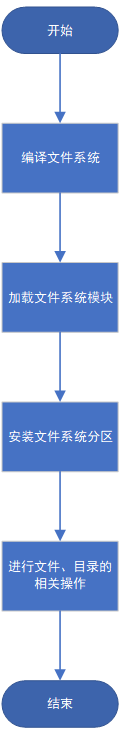
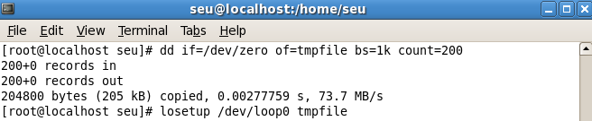
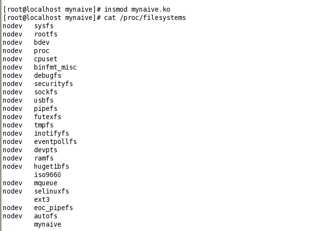
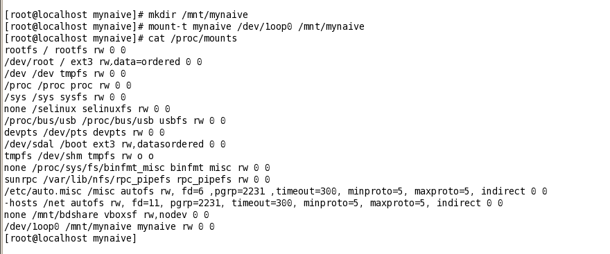
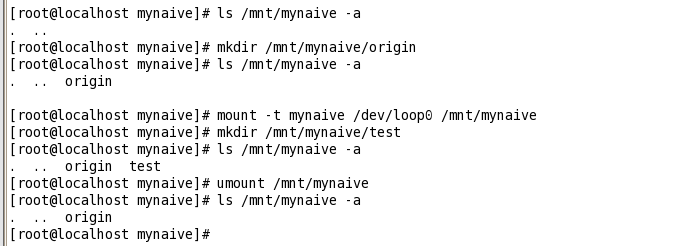
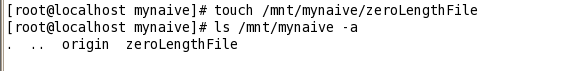
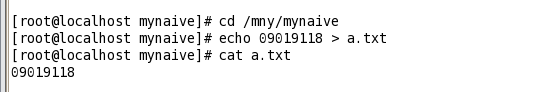
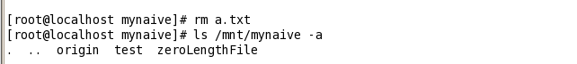

# 操作系统课程设计 实验3——文件系统的实现
09019118 陈鸿卓
August 10, 2021
[TOC]
## 实验内容
实现具有设备创建、分区格式化、注册文件系统、文件夹操作、文件操作功能的完整文件系统。
由于本次实验要求并不明确，本人参考了14级操作系统课程设计的实验要求。如下：
>要求在Linux平台下实现对磁盘文件系统naive的支持，naive文件系统的基本规格说明如下：
>1. 块大小512B。
>2. 文件系统的大小不超过2MB。
>3. 文件/目录的最大长度不超过4KB，文件/目录名不超过30个字符。
>4. 超级快中必须有一成员项，用于放置学号。
>5. 只需要支持普通文件和目录的基本操作，特殊类型的文件不需要考虑。
## 实验目的
通过实验完整了解文件系统实现机制。
## 设计思路与流程图
1. 创建设备
利用Linux的环回设备创建一个伪磁盘设备，无需独立的新分区来存放naive文件系统。
```shell
dd if=/dev/zero of=tmpfile bs=1k count=200
losetup /dev/loop0 tmpfile
```
其中，命令dd创建一个大小为200KB的文件tmpfile；losetup将关联设备/dev/loop0和普通文件tmpfile，以后对设备的读/写操作就转换成了对文件的读/写操作，也就是tmpfile被当成一个块设备了。

2. 格式化分区
1）取得分区大小和打开设备
2）为各种元数据开辟缓冲区，并初始化相应的成员项
3）处理根目录，从索引结点表中分配一个空闲索引节点，填充根索引节点各成员项，然后分配一个空数据块并在根索引节点中登记，然后在该数据块中写入两个目录项：.和..。
4）将步骤2）中的缓冲区写入文件

3. 定义并注册naive文件系统
在文件系统能够使用之前，都必须向内核注册。首先填充file_system_type结构，目前填充的数据成员包括owner，name和fs_flags，name是文件系统名，fs_flags需要指定为FS_REQUIRES_DEV，表示文件系统必须安装在物理磁盘上。
接下来通过register_filesystem函数注册naive文件系统，注册过程放在模块加载时进行。当文件系统不再需要时，通过unregister_filesystem函数注销文件系统。

4. 安装/卸载文件系统分区
注册文件系统后，对第2步的loop0分区进行格式化，通过系统调用mount的执行过程
sys_mount => do_mount => do_new_mount => do_kern_mount
实现struct file_system_type的get_sb方法，得到一个超级块对象即可。六利用内核辅助函数get_sb_bdev，分配一个超级块并初始化其中的若干成员项。此后，还需要实现naive_fill_buffer函数来读取磁盘上超级块信息。为实现从磁盘上读取inode,必须实现naive_read_inode方法。在读inode之前，先分配一个inode存放信息，这里利用slab机制来实现对象的分配，使用文件系统特定的inode结点内嵌通用inode,结构表示为naive_inode_info。
naive_read_inode方法根据inode号从磁盘上读入信息填充inode,根据文件的类型（普通文件和目录）设置相关的操作集。
当卸载一个文件系统的时候，调用file_system_type对象的kill_sb方法，这里直接使用内核提供的kill_block_super完成大部分功能，由naive_put_super函数调用，此外该函数还需包含的操作还有更新超级块、释放naive_fill_super申请的资源等。

5. 显示根目录的内容
要实现读目录，必须支持file_operations和inode_operations两个操作集中的相应方法，针对普通文件和目录的方法也是不同的。
首先是解析路径需要实现的inode_operations的lookup方法。此后是file_operations中的readdir方法，内核对readdir的调用过程如下：
sys_getdents => vfs_readdir => file->f_op->readdir
readdir方法的基本功能是，从文件对象指针filp得到文件操作的当前位置，并开始读取目录项，然后利用填充函数filldir将读取到的内容写入缓冲区dirent。Linux读取目录利用到了page cache机制，文件系统需要实现实现address_space_operations操作集的readpage方法，利用内核的block_read_full_page函数。此后实现naive_get_block函数，从inode中读取块号为iblock的内容放入bh_result。

6. 在根目录下创建内容为空的文件
用户态库函数create或open文件时，使用O_CREAT标志均可创建新文件，相对应的内核系统调用函数为sys_open。创建新文件的执行路径如下：
sys_open=>file_open => open_namei => vfs_create => dir->i_op->create
所以只需实现create函数，所用到的参数包括dir为目录inode指针，dentry为指向新建文件的目录项,mode为新建文件的模式。其中添加目录项的naive_add_nondir函数涉及到对页面缓冲的写操作，需要实现address_space_oparations操作集的三个方法：writepage, prepare_write和commit_write，利用内核提供的辅助函数block_write_full_page, block_prepare_write和generic_commit_write即可。
	为了将目录项写回到磁盘，还需实现naive_update_inode函数，读出位于内存中inode在磁盘上对应的索引结点raw_inode，然后刷新该结点，标记它所在的缓冲区为脏，系统会在合时的时刻刷新buffer cache，这样inode数据能够得到更新。

7. 写文件和读文件
要实现常规文件的读写操作，首先实现文件inode的两个操作集inode_operation和file_operations；其次是支持解析文件名。对于lookup方法的实现，调用naive_inode_by_name方法，根据dentry->d_name找出该目录项所对应的索引结点号ino，然后ino作为参数调用iget读出对应的inode，最后将dentry和inode关联起来。

8. 删除文件
要用到的系统调用是sys_unlink。
第一步，删除文件对应的目录项，其内核执行的路径是
sys_unlink => vfs_unlink => dir->i_op->unlink
所以要实现naive_dir_node_operations操作集中的unlink，通过naive_find_entry函数以页为单位逐次读取目录内容，再通过naive_delete_entry函数删除页page的de项，然后将页page写回磁盘。
第二步，删除文件对应的inode和对应的数据块。其内核执行路径是
sys_unlink => iput => iput_final => generic_drop_inode => generic_delete_inode => inode->i_sb->s_op->delete_inode
因此利用naive_truncate清楚inode在page cache和buffer cache中的数据，然后释放相应的数据块，然后利用naive_free_inode释放磁盘上的inode结点。

9. 创建目录
	创建目录的系统调用是sys_mkdir,其内核执行路径是
sys_mkdir => vfs_mkdir => dir->i_op->mkdir
因此需要实现naive_dir_inode_operations操作集中的mkdir方法，与naive_create方法类似，只是新建的目录需要包含.和..两项。

10. 删除目录
删除目录的系统调用是sys_rmdir,其内核执行路径是
sys_rmdir => vfs_rmdir => dir->i_op->rmdir
因此需要实现naive_dir_inode_operations操作集中的rmdir方法，先调用naive_empty_dir判断目录是否为空，如果不为空，则调用删除文件
的实现naive_unlink。

## 源程序
```c++
static struct file_system_type naive_fs_type = {
	.owner		= THIS_MODULE,
	.name		= "mynaive",
	.get_sb		= naive_get_sb,
	.kill_sb	   = kill_block_super,
	.fs_flags	= FS_REQUIRES_DEV,
};

static int __init init_naive_fs(void)
{
	int err;
err = register_filesystem(&naive_fs_type);
	return err;
}

static void __exit exit_naive_fs(void)
{
	unregister_filesystem(&naive_fs_type);
}

module_init(init_naive_fs)
module_exit(exit_naive_fs)

static int naive_get_sb(struct file_system_type *fs_type,
	int flags, const char *dev_name, void *data, struct vfsmount *mnt)
{
	return get_sb_bdev(fs_type, flags, dev_name, data, naive_fill_super, mnt);
}

static int naive_fill_super(struct super_block *sb, void *data, int silent) {
	struct buffer_head * bh;
	struct naive_sb_info * sbi;
	struct naive_super_block * es;
	struct inode *root;
	unsigned long block;
	unsigned long sb_block = get_sb_block(&data);
	unsigned long logic_sb_block;
	unsigned long offset = 0;
	unsigned long def_mount_opts;
	int blocksize = BLOCK_SIZE;
	int db_count;
	int i, j;
	__le32 features;

	sbi = kzalloc(sizeof(*sbi), GFP_KERNEL);
	if (!sbi)
		return -ENOMEM;
	sb->s_fs_info = sbi;

	/*
	 * See what the current blocksize for the device is, and
	 * use that as the blocksize.  Otherwise (or if the blocksize
	 * is smaller than the default) use the default.
	 * This is important for devices that have a hardware
	 * sectorsize that is larger than the default.
	 */
	blocksize = sb_min_blocksize(sb, BLOCK_SIZE);
	if (!blocksize) {
		printk ("NAIVE-fs: unable to set blocksize\n");
		goto failed_sbi;
	}

	/*
	 * If the superblock doesn't start on a hardware sector boundary,
	 * calculate the offset.  
	 */
	if (blocksize != BLOCK_SIZE) {
		logic_sb_block = (sb_block*BLOCK_SIZE) / blocksize;
		offset = (sb_block*BLOCK_SIZE) % blocksize;
	} else {
		logic_sb_block = sb_block;
	}

	if (!(bh = sb_bread(sb, logic_sb_block))) {
		printk ("NAIVE -fs: unable to read superblock\n");
		goto failed_sbi;
	}
	/*
	 * Note: s_es must be initialized as soon as possible because
	 *       some naive macro-instructions depend on its value
	 */
	es = (struct naive_super_block *) (((char *)bh->b_data) + offset);
	sbi->s_es = es;
	sb->s_magic = le16_to_cpu(es->s_magic);

	if (sb->s_magic != EXT2_SUPER_MAGIC)
		goto cantfind_ext2;

	/* Set defaults before we parse the mount options */
	def_mount_opts = le32_to_cpu(es->s_default_mount_opts);
	if (def_mount_opts & EXT2_DEFM_DEBUG)
		set_opt(sbi->s_mount_opt, DEBUG);
	if (def_mount_opts & EXT2_DEFM_BSDGROUPS)
		set_opt(sbi->s_mount_opt, GRPID);
	if (def_mount_opts & EXT2_DEFM_UID16)
		set_opt(sbi->s_mount_opt, NO_UID32);
#ifdef CONFIG_EXT2_FS_XATTR
	if (def_mount_opts & EXT2_DEFM_XATTR_USER)
		set_opt(sbi->s_mount_opt, XATTR_USER);
#endif
#ifdef CONFIG_EXT2_FS_POSIX_ACL
	if (def_mount_opts & EXT2_DEFM_ACL)
		set_opt(sbi->s_mount_opt, POSIX_ACL);
#endif
	
	if (le16_to_cpu(sbi->s_es->s_errors) == EXT2_ERRORS_PANIC)
		set_opt(sbi->s_mount_opt, ERRORS_PANIC);
	else if (le16_to_cpu(sbi->s_es->s_errors) == EXT2_ERRORS_RO)
		set_opt(sbi->s_mount_opt, ERRORS_RO);
	else
		set_opt(sbi->s_mount_opt, ERRORS_CONT);

	sbi->s_resuid = le16_to_cpu(es->s_def_resuid);
	sbi->s_resgid = le16_to_cpu(es->s_def_resgid);
	
	if (!parse_options ((char *) data, sbi))
		goto failed_mount;

	sb->s_flags = (sb->s_flags & ~MS_POSIXACL) |
		((EXT2_SB(sb)->s_mount_opt & EXT2_MOUNT_POSIX_ACL) ?
		 MS_POSIXACL : 0);

	ext2_xip_verify_sb(sb); /* see if bdev supports xip, unset
				    EXT2_MOUNT_XIP if not */

	if (le32_to_cpu(es->s_rev_level) == EXT2_GOOD_OLD_REV &&
	    (EXT2_HAS_COMPAT_FEATURE(sb, ~0U) ||
	     EXT2_HAS_RO_COMPAT_FEATURE(sb, ~0U) ||
	     EXT2_HAS_INCOMPAT_FEATURE(sb, ~0U)))
		printk("EXT2-fs warning: feature flags set on rev 0 fs, "
		       "running e2fsck is recommended\n");
	/*
	 * Check feature flags regardless of the revision level, since we
	 * previously didn't change the revision level when setting the flags,
	 * so there is a chance incompat flags are set on a rev 0 filesystem.
	 */
	features = EXT2_HAS_INCOMPAT_FEATURE(sb, ~EXT2_FEATURE_INCOMPAT_SUPP);
	if (features) {
		printk("EXT2-fs: %s: couldn't mount because of "
		       "unsupported optional features (%x).\n",
		       sb->s_id, le32_to_cpu(features));
		goto failed_mount;
	}
	if (!(sb->s_flags & MS_RDONLY) &&
	    (features = EXT2_HAS_RO_COMPAT_FEATURE(sb, ~EXT2_FEATURE_RO_COMPAT_SUPP))){
		printk("EXT2-fs: %s: couldn't mount RDWR because of "
		       "unsupported optional features (%x).\n",
		       sb->s_id, le32_to_cpu(features));
		goto failed_mount;
	}

	blocksize = BLOCK_SIZE << le32_to_cpu(sbi->s_es->s_log_block_size);

	if ((ext2_use_xip(sb)) && ((blocksize != PAGE_SIZE) ||
				  (sb->s_blocksize != blocksize))) {
		if (!silent)
			printk("XIP: Unsupported blocksize\n");
		goto failed_mount;
	}

	/* If the blocksize doesn't match, re-read the thing.. */
	if (sb->s_blocksize != blocksize) {
		brelse(bh);

		if (!sb_set_blocksize(sb, blocksize)) {
			printk(KERN_ERR " NAIVE -fs: blocksize too small for device.\n");
			goto failed_sbi;
		}

		logic_sb_block = (sb_block*BLOCK_SIZE) / blocksize;
		offset = (sb_block*BLOCK_SIZE) % blocksize;
		bh = sb_bread(sb, logic_sb_block);
		if(!bh) {
			printk("NAIVE-fs: Couldn't read superblock on "
			       "2nd try.\n");
			goto failed_sbi;
		}
		es = (struct naive_super_block *) (((char *)bh->b_data) + offset);
		sbi->s_es = es;
		if (es->s_magic != cpu_to_le16(EXT2_SUPER_MAGIC)) {
			printk ("NAIVE -fs: Magic mismatch, very weird !\n");
			goto failed_mount;
		}
	}

	sb->s_maxbytes = ext2_max_size(sb->s_blocksize_bits);

	if (le32_to_cpu(es->s_rev_level) == EXT2_GOOD_OLD_REV) {
		sbi->s_inode_size = EXT2_GOOD_OLD_INODE_SIZE;
		sbi->s_first_ino = EXT2_GOOD_OLD_FIRST_INO;
	} else {
		sbi->s_inode_size = le16_to_cpu(es->s_inode_size);
		sbi->s_first_ino = le32_to_cpu(es->s_first_ino);
		if ((sbi->s_inode_size < EXT2_GOOD_OLD_INODE_SIZE) ||
		    (sbi->s_inode_size & (sbi->s_inode_size - 1)) ||
		    (sbi->s_inode_size > blocksize)) {
			printk ("NAIVE -fs: unsupported inode size: %d\n",
				sbi->s_inode_size);
			goto failed_mount;
		}
	}

	sbi->s_frag_size = EXT2_MIN_FRAG_SIZE <<
				   le32_to_cpu(es->s_log_frag_size);
	if (sbi->s_frag_size == 0)
		goto cantfind_ext2;
	sbi->s_frags_per_block = sb->s_blocksize / sbi->s_frag_size;

	sbi->s_blocks_per_group = le32_to_cpu(es->s_blocks_per_group);
	sbi->s_frags_per_group = le32_to_cpu(es->s_frags_per_group);
	sbi->s_inodes_per_group = le32_to_cpu(es->s_inodes_per_group);

	if (EXT2_INODE_SIZE(sb) == 0)
		goto cantfind_ext2;
	sbi->s_inodes_per_block = sb->s_blocksize / EXT2_INODE_SIZE(sb);
	if (sbi->s_inodes_per_block == 0 || sbi->s_inodes_per_group == 0)
		goto cantfind_ext2;
	sbi->s_itb_per_group = sbi->s_inodes_per_group /
					sbi->s_inodes_per_block;
	sbi->s_desc_per_block = sb->s_blocksize /
					sizeof (struct ext2_group_desc);
	sbi->s_sbh = bh;
	sbi->s_mount_state = le16_to_cpu(es->s_state);
	sbi->s_addr_per_block_bits =
		ilog2 (EXT2_ADDR_PER_BLOCK(sb));
	sbi->s_desc_per_block_bits =
		ilog2 (EXT2_DESC_PER_BLOCK(sb));

	if (sb->s_magic != EXT2_SUPER_MAGIC)
		goto cantfind_ext2;

	if (sb->s_blocksize != bh->b_size) {
		if (!silent)
			printk ("VFS: Unsupported blocksize on dev "
				"%s.\n", sb->s_id);
		goto failed_mount;
	}

	if (sb->s_blocksize != sbi->s_frag_size) {
		printk ("EXT2-fs: fragsize %lu != blocksize %lu (not supported yet)\n",
			sbi->s_frag_size, sb->s_blocksize);
		goto failed_mount;
	}

	if (sbi->s_blocks_per_group > sb->s_blocksize * 8) {
		printk ("EXT2-fs: #blocks per group too big: %lu\n",
			sbi->s_blocks_per_group);
		goto failed_mount;
	}
	if (sbi->s_frags_per_group > sb->s_blocksize * 8) {
		printk ("EXT2-fs: #fragments per group too big: %lu\n",
			sbi->s_frags_per_group);
		goto failed_mount;
	}
	if (sbi->s_inodes_per_group > sb->s_blocksize * 8) {
		printk ("EXT2-fs: #inodes per group too big: %lu\n",
			sbi->s_inodes_per_group);
		goto failed_mount;
	}

	if (EXT2_BLOCKS_PER_GROUP(sb) == 0)
		goto cantfind_ext2;
 	sbi->s_groups_count = ((le32_to_cpu(es->s_blocks_count) -
 				le32_to_cpu(es->s_first_data_block) - 1)
 					/ EXT2_BLOCKS_PER_GROUP(sb)) + 1;
	db_count = (sbi->s_groups_count + EXT2_DESC_PER_BLOCK(sb) - 1) /
		   EXT2_DESC_PER_BLOCK(sb);
	sbi->s_group_desc = kmalloc (db_count * sizeof (struct buffer_head *), GFP_KERNEL);
	if (sbi->s_group_desc == NULL) {
		printk ("EXT2-fs: not enough memory\n");
		goto failed_mount;
	}
	bgl_lock_init(&sbi->s_blockgroup_lock);
	sbi->s_debts = kmalloc(sbi->s_groups_count * sizeof(*sbi->s_debts),
			       GFP_KERNEL);
	if (!sbi->s_debts) {
		printk ("EXT2-fs: not enough memory\n");
		goto failed_mount_group_desc;
	}
	memset(sbi->s_debts, 0, sbi->s_groups_count * sizeof(*sbi->s_debts));
	for (i = 0; i < db_count; i++) {
		block = descriptor_loc(sb, logic_sb_block, i);
		sbi->s_group_desc[i] = sb_bread(sb, block);
		if (!sbi->s_group_desc[i]) {
			for (j = 0; j < i; j++)
				brelse (sbi->s_group_desc[j]);
			printk ("NAIVE -fs: unable to read group descriptors\n");
			goto failed_mount_group_desc;
		}
	}
	if (!ext2_check_descriptors (sb)) {
		printk ("NAIVE -fs: group descriptors corrupted!\n");
		goto failed_mount2;
	}
	sbi->s_gdb_count = db_count;
	get_random_bytes(&sbi->s_next_generation, sizeof(u32));
	spin_lock_init(&sbi->s_next_gen_lock);

	percpu_counter_init(&sbi->s_freeblocks_counter,
				ext2_count_free_blocks(sb));
	percpu_counter_init(&sbi->s_freeinodes_counter,
				ext2_count_free_inodes(sb));
	percpu_counter_init(&sbi->s_dirs_counter,
				ext2_count_dirs(sb));
	/*
	 * set up enough so that it can read an inode
	 */
	sb->s_op = &naive_sops;
	sb->s_export_op = &ext2_export_ops;
	sb->s_xattr = ext2_xattr_handlers;
	root = iget(sb, EXT2_ROOT_INO);
	sb->s_root = d_alloc_root(root);
	if (!sb->s_root) {
		iput(root);
		printk(KERN_ERR " NAIVE -fs: get root inode failed\n");
		goto failed_mount3;
	}
	if (!S_ISDIR(root->i_mode) || !root->i_blocks || !root->i_size) {
		dput(sb->s_root);
		sb->s_root = NULL;
		printk(KERN_ERR " NAIVE -fs: corrupt root inode, run e2fsck\n");
		goto failed_mount3;
	}
	if (EXT2_HAS_COMPAT_FEATURE(sb, EXT3_FEATURE_COMPAT_HAS_JOURNAL))
		ext2_warning(sb, __FUNCTION__,
			"mounting ext3 filesystem as ext2");
	ext2_setup_super (sb, es, sb->s_flags & MS_RDONLY);
	return 0;

cantfind_ext2:
	if (!silent)
		printk("VFS: Can't find an ext2 filesystem on dev %s.\n",
		       sb->s_id);
	goto failed_mount;
failed_mount3:
	percpu_counter_destroy(&sbi->s_freeblocks_counter);
	percpu_counter_destroy(&sbi->s_freeinodes_counter);
	percpu_counter_destroy(&sbi->s_dirs_counter);
failed_mount2:
	for (i = 0; i < db_count; i++)
		brelse(sbi->s_group_desc[i]);
failed_mount_group_desc:
	kfree(sbi->s_group_desc);
	kfree(sbi->s_debts);
failed_mount:
	brelse(bh);
failed_sbi:
	sb->s_fs_info = NULL;
	kfree(sbi);
	return -EINVAL;
}

static struct super_operations naive_sops = {
.alloc_inode   = naive_alloc_inode,
.destroy_inode = naive_destroy_inode,
.read_inode   = naive_read_inode,
.put_super    = naive_put_super,
};

struct naive_inode_info {
	__le32 i_data[15];
	__u32  i_flags;
	struct inode vfs_inode;
};

static kmem_cache_t* naive_inode_cachep;

static struct inode* naive_alloc_inode (struct super_block* sb) {
	struct naive_inode_info* ei;
	ei = (struct naive_inode_info*) kmen_cache_alloc(naive_inode_cachep, GFP_KERNEL);
	return &ei->vfs_inode;
}

static struct naive_inode_info* NAIVE_I(struct inode* inode) {
	return container_of(inode, struct naive_inode_info, vfs_inode);
}

static void naive_destroy_inode (struct inode* inode) {
	kmen_cache_free(naive_inode_cachep, NAIVE_I(inode));
}

// read inode by i_ino from disk to fill inode
void naive_read_inode (struct inode* inode) {
	struct naive_inode_info* ei = NAIVE_I(inode);
	ino_t ino = inode->i_ino;
	struct buffer_head* bh;
	
	struct naive_inode* raw_inode = naive_get_inode(inode->i_sb, ino, &bh);

	// init inode and ei by raw_inode
	if (S_ISREG(inode->i_mode)) { // normal file
		inode->i_op = &naive_file_inode_operations;
		inode->i_fop = &naive_file_operations;
		if (test_opt(inode->i_sb, NOBH)) {
			inode->i_mapping->a_ops = &naive_nobh_aops;
		} else {
			inode->i_mapping->a_ops = &naive_aops;
		}
	} else if (S_ISDIR(inode->i_mode)) { // is a dictionary
		inode->i_op = &naive_dir_inode_operations;
		inode->i_fop = &naive_dir_operations;
		if (test_opt(inode->i_sb, NOBH)) {
			inode->i_mapping->a_ops = &naive_nobh_aops;
		} else {
			inode->i_mapping->a_ops = &naive_aops;
		}
	}
}

static struct dentry* naive_lookup (struct inode* dir, struct dentry* dentry, struct nameidata* nd) {
	struct inode* inode;
	ino_t ino;
	ino = naive_inode_by_name(dir, dentry);
	inode = NULL;
	if (ino)
		inode = iget(dir->i_sb, ino);
	if (inode)
		return d_splice_alias(inode, dentry);
	d_add(dentry, inode);
	return NULL;
}

static int naive_readdir (struct file * filp, void * dirent, filldir_t filldir) {
	loff_t pos = filp->f_pos;
	struct inode *inode = filp->f_path.dentry->d_inode;
	struct super_block *sb = inode->i_sb;
	unsigned int offset = pos & ~PAGE_CACHE_MASK;
	unsigned long n = pos >> PAGE_CACHE_SHIFT;
	unsigned long npages = dir_pages(inode);
	unsigned chunk_mask = ~(ext2_chunk_size(inode)-1);
	unsigned char *types = NULL;
	int need_revalidate = filp->f_version != inode->i_version;

	if (pos > inode->i_size - EXT2_DIR_REC_LEN(1))
		return 0;

	if (EXT2_HAS_INCOMPAT_FEATURE(sb, EXT2_FEATURE_INCOMPAT_FILETYPE))
		types = ext2_filetype_table;

	for ( ; n < npages; n++, offset = 0) {
		char *kaddr, *limit;
		ext2_dirent *de;
		struct page *page = ext2_get_page(inode, n);

		if (IS_ERR(page)) {
			ext2_error(sb, __FUNCTION__,
				   "bad page in #%lu",
				   inode->i_ino);
			filp->f_pos += PAGE_CACHE_SIZE - offset;
			return -EIO;
		}
		kaddr = page_address(page);
		if (unlikely(need_revalidate)) {
			if (offset) {
				offset = ext2_validate_entry(kaddr, offset, chunk_mask);
				filp->f_pos = (n<<PAGE_CACHE_SHIFT) + offset;
			}
			filp->f_version = inode->i_version;
			need_revalidate = 0;
		}
		de = (ext2_dirent *)(kaddr+offset);
		limit = kaddr + ext2_last_byte(inode, n) - EXT2_DIR_REC_LEN(1);
		for ( ;(char*)de <= limit; de = ext2_next_entry(de)) {
			if (de->rec_len == 0) {
				ext2_error(sb, __FUNCTION__,
					"zero-length directory entry");
				ext2_put_page(page);
				return -EIO;
			}
			if (de->inode) {
				int over;
				unsigned char d_type = DT_UNKNOWN;

				if (types && de->file_type < EXT2_FT_MAX)
					d_type = types[de->file_type];

				offset = (char *)de - kaddr;
				over = filldir(dirent, de->name, de->name_len,
						(n<<PAGE_CACHE_SHIFT) | offset,
						le32_to_cpu(de->inode), d_type);
				if (over) {
					ext2_put_page(page);
					return 0;
				}
			}
			filp->f_pos += le16_to_cpu(de->rec_len);
		}
		ext2_put_page(page);
	}
	return 0;
}

static int naive_readpage(struct file* file, struct page* page) {
return block_read_full_page(page, naive_get_block);
}

struct address_space_operations naive_aops = {
	.readpage = naive_readpage,
};

struct file_operations naive_file_operations = {
	.read = do_sync_read,
	.write = do_sync_write,
};

struct inode_operations naive_file_inode_operations = {
	.truncate = naive_truncate,
};

static int naive_create (struct inode* dir, struct dentry* dentry, int mode, struct nameidata* nd) {
	struct inode* inode = ext2_new_inode(dir, mode);
	int err = PTR_ERR(inode);
	if (!IS_ERR(inode)) {
		inode->i_op = &naive_file_inode_operations;
		inode->i_fop = &naive_file_operations;
		
		if (test_opt(inode->i_sb, NOBH)) 
			inode->i_mapping->a_ops = &naive_nobh_aops;
		else
			inode->i_mapping->a_ops = &naive_aops;
		
		mark_inode_dirty(inode);
		err = ext2_add_nondir(dentry, inode);
	} 
	return err;
}

struct inode_operations naive_dir_inode_operations = {
	.create = naive_create,
	.lookup = naive_lookup,
	.unlink = naive_unlink,
	.mkdir = naive_mkdir,
};

static int naive_mkdir(struct inode * dir, struct dentry * dentry, int mode)
{
	struct inode * inode;
	int err = -EMLINK;

	if (dir->i_nlink >= EXT2_LINK_MAX)
		goto out;

	inode_inc_link_count(dir);

	inode = ext2_new_inode (dir, S_IFDIR | mode);
	err = PTR_ERR(inode);
	if (IS_ERR(inode))
		goto out_dir;

	inode->i_op = &naive_dir_inode_operations;
	inode->i_fop = &naive_dir_operations;
	if (test_opt(inode->i_sb, NOBH))
		inode->i_mapping->a_ops = &naive_nobh_aops;
	else
		inode->i_mapping->a_ops = &naive_aops;

	inode_inc_link_count(inode);

	err = ext2_make_empty(inode, dir);
	if (err)
		goto out_fail;

	err = ext2_add_link(dentry, inode);
	if (err)
		goto out_fail;

	d_instantiate(dentry, inode);
out:
	return err;

out_fail:
	inode_dec_link_count(inode);
	inode_dec_link_count(inode);
	iput(inode);
out_dir:
	inode_dec_link_count(dir);
	goto out;
}

static int naive_unlink(struct inode * dir, struct dentry *dentry)
{
	struct inode * inode = dentry->d_inode;
	struct ext2_dir_entry_2 * de;
	struct page * page;
	int err = -ENOENT;

	de = ext2_find_entry (dir, dentry, &page);
	if (!de)
		goto out;

	err = ext2_delete_entry (de, page);
	if (err)
		goto out;

	inode->i_ctime = dir->i_ctime;
	inode_dec_link_count(inode);
	err = 0;
out:
	return err;
}

static int naive_rmdir (struct inode * dir, struct dentry *dentry)
{
	struct inode * inode = dentry->d_inode;
	int err = -ENOTEMPTY;

	if (ext2_empty_dir(inode)) {
		err = ext2_unlink(dir, dentry);
		if (!err) {
			inode->i_size = 0;
			inode_dec_link_count(inode);
			inode_dec_link_count(dir);
		}
	}
	return err;
}

```
## 程序运行时的初值和运行结果
创建设备


加载模块，注册mynaive文件系统，打开系统的filesystems，最后为刚加载的mynaive


安装设备/dev/loop0，用cat命令查看安装分区的信息。


在/mnt/mynaive目录下创建origin目录，显示目前有三个目录项。而如果在安装文件系统的情况下创建目录test，那么卸载文件系统后，无法看到test目录。


利用touch命令生成一个大小为0的文件。


通过echo命令创建a.txt文件并输入本人学号，并通过cat命令查看该文件。


通过rm命令删除a.txt文件。

## 实验体会
文件系统是一个非常大的工程，短短时间内很难全部弄懂并进行实现，所以本次实验基本参考ext2文件系统，进行功能上的简化，完成基本的文件/目录创建和删除操作。
试验中最难的部分在于大量的函数是由内核提供，并由于ext2代码的复杂度较高，源码中有很多难以理解的调用函数，想要立即掌握工作原理不易，调试也是无从下手。因此，在基于实验指南的基础上，我网上查阅了很多文件系统的信息，先从整体上了解工作机制，再保留基本原理的情况下，忽视错误信息提示等非主干成分。对于编程难度较高的部分，以调用ext2提供的函数作为替代。同时之前对于Linux环境下的编译链接等工作不熟悉，需要手动编写Makefile文件以辅助完成编译模块的工作，为此参考了已有的Makefile文件并查找了相关的写法。
本次的实验让我意识到，当真正把书本上的知识理论应用到实际工作中时，其中需要跨过非常多的鸿沟，很多时候牵涉到的知识是需要长时间的编程工作才能有所掌握。